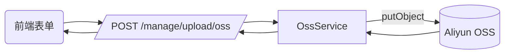
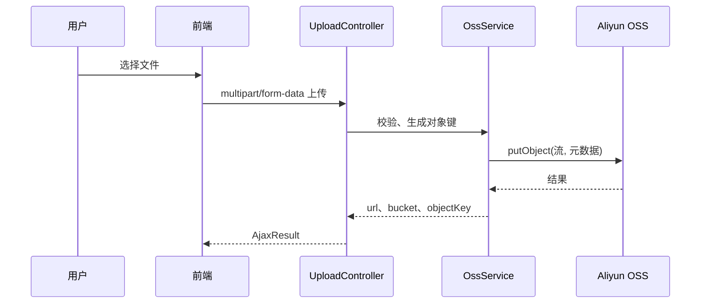

# 模块报告：OSS 上传

## 领域模型
本模块不涉及业务表，仅作为统一文件存储网关。

对象命名：`basePath/yyyy/MM/dd/uuid.ext`。

## 关键流程

## 权限说明
- 接口权限：`manage:upload:oss`
- 按钮权限：前端 `v-hasPermi=['manage:upload:oss']`

## 已知限制与风险
- 预签名 URL 过期后不可访问（默认 1 小时）；若需长期公开，需配置公共读或 CDN 域名。
- 大文件（> 100MB）建议前端直传策略（STS + 分片）；当前实现为后端中转上传。
- AK/SK 需通过环境变量注入，不可写入仓库或数据库。

## 后续计划
- 增加直传策略接口（STS 临时凭证、PostPolicy、分片续传）。
- 增加病毒扫描与内容审核异步任务。

