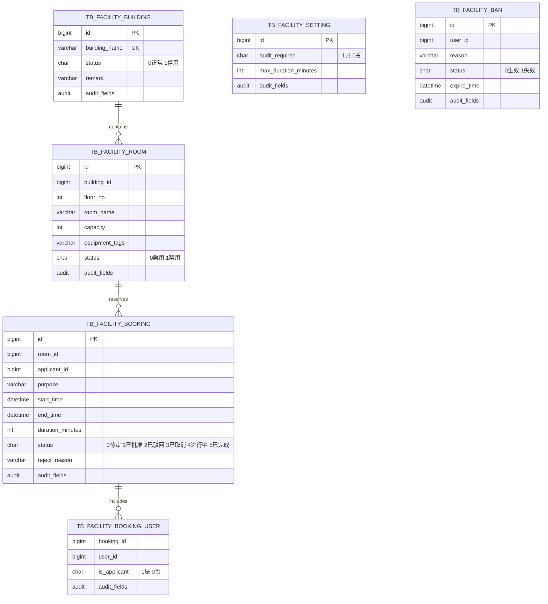
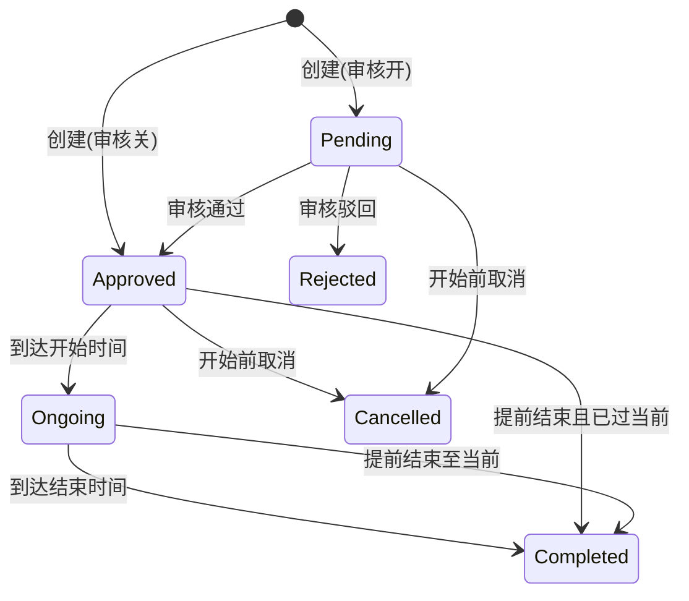
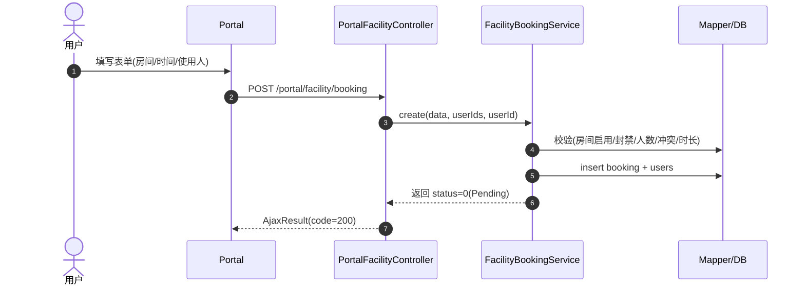
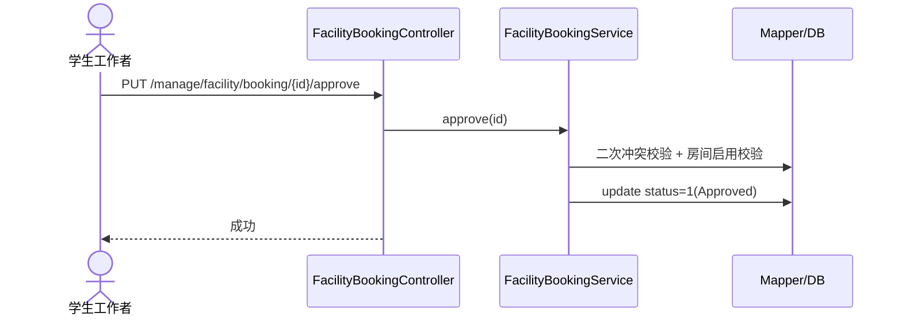

# 功能房预约模块 报告（MVP）

> 本报告覆盖领域模型、关键流程、权限矩阵、实现要点、已知限制与后续计划，供走查与验收使用。

## 1. 领域模型

补充说明：
- 冲突判定采用半开区间 [start, end)，SQL 见 `FacilityBookingMapper.countConflict`。
- 时间轴仅展示 pending/approved/ongoing/completed；取消与驳回不占用日历。

## 2. 状态流转

关键约束：
- 取消仅限 Pending/Approved 且开始前；
- 提前结束仅限 Approved/Ongoing；
- 被驳回可修改并重提（依据审核开关重新进入 Pending/Approved）。

## 3. 关键流程（时序）

创建预约（审核开启）：

审核通过：

## 4. 权限矩阵（摘）

| 模块 | 路径 | 权限标识 |
|---|---|---|
| 楼房 | /manage/facility/building/* | manage:facility:building:list/get/add/edit/remove |
| 房间 | /manage/facility/room/* | manage:facility:room:list/get/timeline/add/edit/enable/remove |
| 预约审核 | /manage/facility/booking/* | manage:facility:booking:audit:list/approve/reject |
| 设置 | /manage/facility/setting/* | manage:facility:setting:get/edit |
| 封禁 | /manage/facility/ban/* | manage:facility:ban:list/add/remove |
| 排行榜 | /manage/facility/top/* | manage:facility:top:room/user |

角色建议：
- user：门户接口（认证即可）；
- staff：审核、封禁、榜单只读；
- admin/super_admin：本模块全部权限。

## 5. 实现要点与对齐

- 冲突校验：`countConflict(roomId, start, end, excludeId)`，与 status in('0','1','4') 比较，采用半开区间；
- 审核开关：`tb_facility_setting.audit_required`；关闭时创建直接 Approved；
- 封禁：只限制作为“申请人”的提交，允许其作为“使用人”；
- 时间轴：后端 Mapper 将 status 映射为 pending/approved/ongoing/completed；前端按颜色区分并支持点击查看详情；
- 友好化：
  - “我的预约”返回 `roomName` 并在前端展示；
  - 时间轴 tooltip 中文文案；
  - 详情弹窗状态本地映射回退。

## 6. 自检清单（MVP）

- [x] 表结构与示例数据：见 `book-mis.sql`（含索引修订说明）
- [x] API 文档：`docs/api/功能房预约.md`
- [x] Apifox 指南：`docs/apifox/功能房预约.md`
- [x] 前端页面：门户（列表/详情/我的预约）、管理端（楼房/房间/审核/封禁/设置/排行榜）
- [ ] 后端测试：成功/失败/权限（待补）
- [x] 菜单与权限指引：`docs/ruoyi-opt/功能房预约-菜单与权限配置.md`

## 7. 已知限制与风险

- 自动状态进位未落地：Approved→Ongoing→Completed 由定时任务推进尚未实现；当前以查询/操作时的约束为主；
- 排行榜无 Redis 缓存：当前 DB 统计满足 MVP，后续可引入缓存 + 定时刷新（key: `app:facility:rank:*`）；
- 使用人校验依赖 `sys_user` 存量：若未导入用户，将导致“存在无效的用户ID”的校验失败；
- 时间粒度未强制 30 分钟：由业务层统一冲突校验，若需严格 30 分钟粒度，可在前端控件与后端校验同步收敛；
- 门户“我的预约”仅显示申请人视角：如需“我参与的预约”，需新增查询；

## 8. 后续计划（建议）

1) 定时任务：每分钟推进状态 + 写入审计日志；
2) 排行榜缓存化：Redis + 失效策略；
3) 门户增强：
   - 我参与的预约列表（作为使用人）；
   - 时间轴范围快捷切换（7天/30天）；
4) 运营面板：房间使用率、预约按时段分布等统计；
5) 测试补齐：后端三类场景 + 前端关键流程手测用例汇总。

---

附：后台菜单与权限配置详见 `docs/ruoyi-opt/功能房预约-菜单与权限配置.md`。

