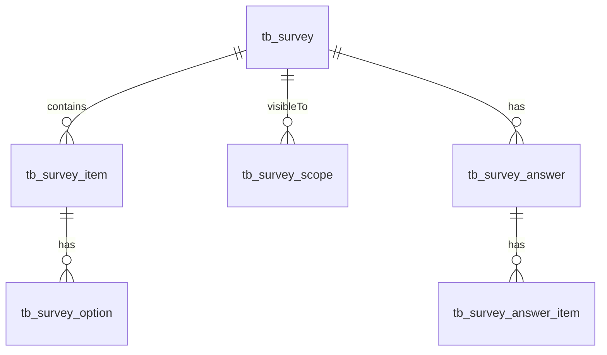
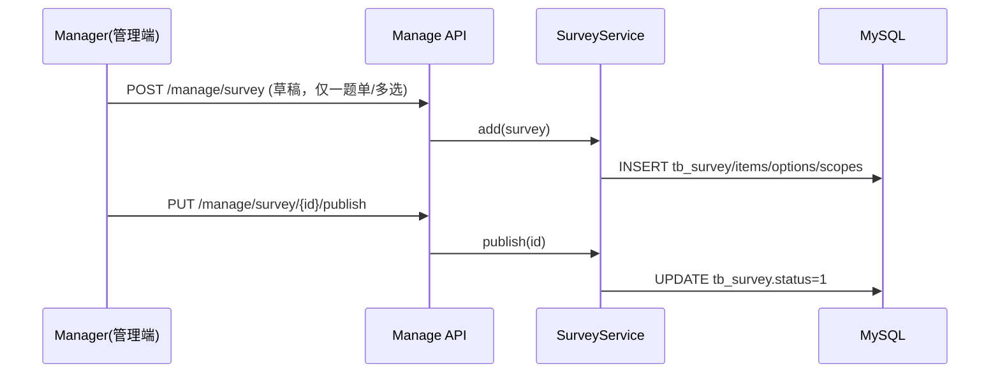
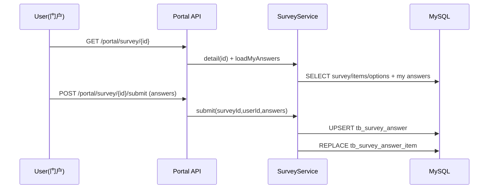
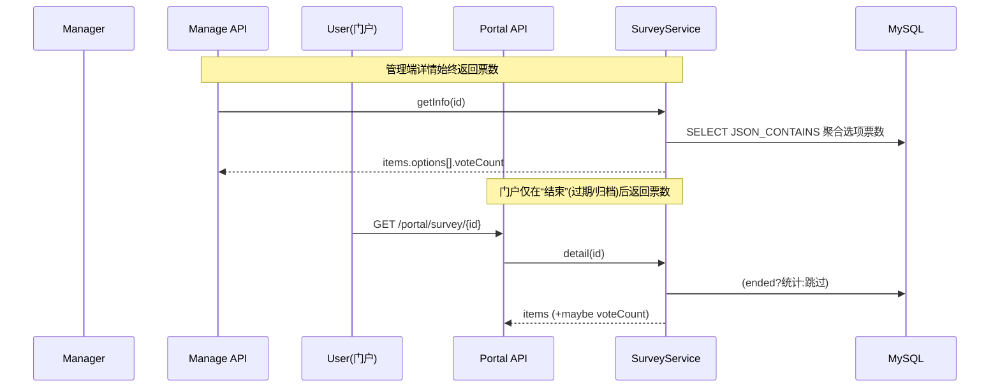
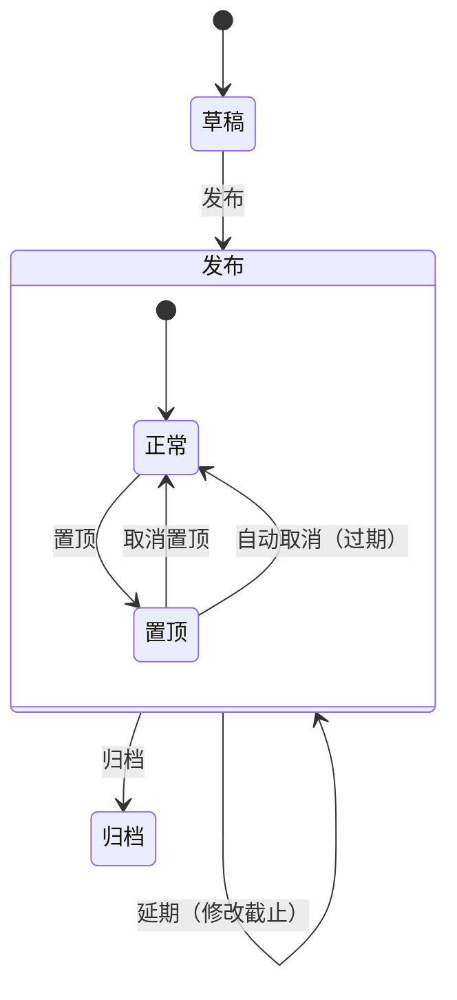

# 模块报告：投票（最简实现，复用问卷）

> 说明：本模块不新增独立数据结构，完全复用“问卷（表单收集）”模型与接口，仅约定“投票=仅包含一题的选择题（单选/多选）”。管理端详情始终返回票数统计；门户端仅在投票结束（过期或归档）后展示票数与柱状图。

## 领域模型

- tb_survey：投票头信息（标题、状态、截止、可见范围、置顶）。
- tb_survey_item：题目（投票约定仅一题，类型=2单选/3多选）。
- tb_survey_option：投票选项（排序、展示文本）。
- tb_survey_scope：可见范围（角色/部门/岗位并集）。
- tb_survey_answer：用户提交的一份投票结果（每人一份，唯一键 uk_survey_user）。
- tb_survey_answer_item：答案明细（仅用于存储所选选项ID集合，唯一键 uk_answer_item）。

数据特性与约束（选要）：
- 唯一性：tb_survey_answer (survey_id,user_id) 唯一，保证“一人一票，可覆盖修改”。
- 软删与审计：所有表均含 create_by/create_time/update_by/update_time/del_flag。
- 置顶：tb_survey.pinned(0/1), pinned_time；过期自动取消置顶。

## 关键流程

### 管理端：新建并发布投票

### 门户：参与与覆盖提交

### 票数统计与结果展示

### 状态流转与置顶

## 权限说明
- 按钮级权限（管理端，与问卷一致）：
  - 列表：manage:survey:list
  - 详情：manage:survey:query
  - 新建/编辑（仅草稿）：manage:survey:add, manage:survey:edit
  - 发布：manage:survey:publish
  - 延期：manage:survey:extend
  - 归档：manage:survey:archive
  - 置顶/取消置顶：manage:survey:pin
- 角色建议：
  - 管理员/超级管理员：拥有全部 manage:survey:* 权限。
  - 普通用户：仅门户访问（需登录 isAuthenticated()）。
  - 专业负责人/学生工作者：按需授予管理权限（非必须，本模块无专业维度）。

## 界面与入口
- 管理端路由：/manage/vote/index | /manage/vote/new | /manage/vote/archive（静态注册，复用问卷接口）。
- 门户路由：/portal/vote | /portal/vote/fill?id=xxx | /portal/vote/my。
- 图表：ECharts 柱状图（管理端始终显示；门户仅结束后显示）。

## 数据一致性与并发
- 幂等约束：tb_survey_answer (survey_id,user_id) 唯一，提交采用 UPSERT + 明细 REPLACE，覆盖上次投票。
- 截止控制：submit 时校验 status==1 且未过 deadline；过期后不可提交。
- 可见范围：管理员不过滤；门户对非管理员按“全员|命中范围”过滤（角色/部门/岗位并集）。
- 置顶自动化：定时或每次查询前执行 unpinExpired，确保过期后自动取消置顶。

## 已知限制与风险
- MVP 限制：
  - 前端创建页强约束“仅一题的单/多选投票”；后端虽支持多题，但不推荐在投票场景使用。
  - 不支持匿名投票；答卷关联 sys_user。
  - 报表导出、实时大屏、题型扩展（文件/日期）未实现。
- 性能注意：大规模答卷下，JSON_CONTAINS 聚合统计存在一定计算开销，必要时可引入增量统计表或缓存。

## 迭代建议
- 门户结果按比例/百分比展示，支持总票数与占比切换。
- 导出报表（CSV/Excel），含选项票数明细与未投名单（按范围差集计算）。
- 匿名开关、重复投票策略（允许重复但去重最新/最早等）。
- 可见范围选择器（角色/部门/岗位）管理端交互完善；多维筛选与搜索。
- 题型扩展（文件上传、日期时间）、题目权重、加权计票等进阶能力。

## 相关文档
- 需求：docs/requirements/投票.md
- API：docs/api/投票.md（接口映射与示例）
- Apifox：docs/apifox/投票.md（断言步骤与常见失败）
- 问卷报告（被本模块复用）：docs/report/问卷.md

