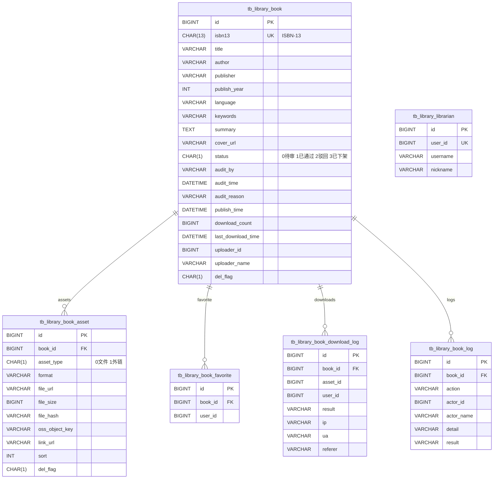
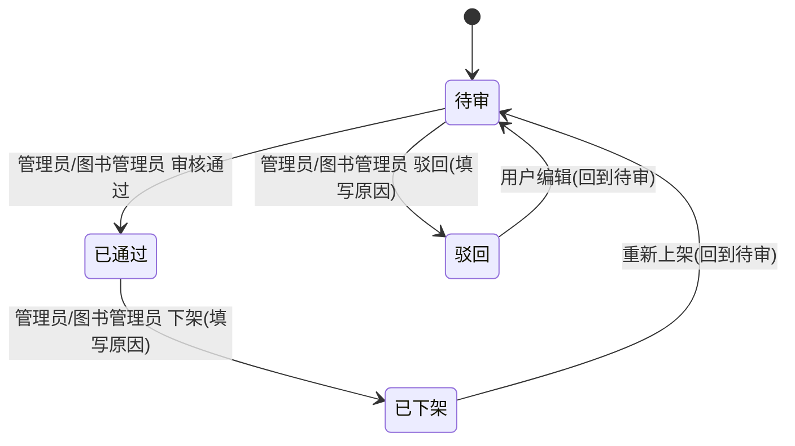
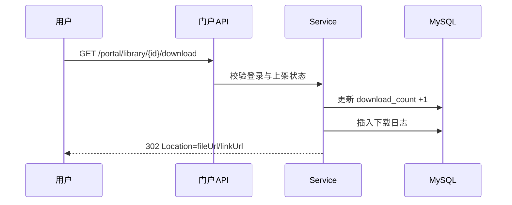

# 数字图书馆（模块报告 v1）

更新时间：2025-11-06

## 概览
- 目标：为校内用户提供“电子图书/资料”的上传（走审核）、发布/下架、下载访问、收藏与排行榜能力。
- 角色与权限：用户（上传/收藏）、图书管理员（审核/上下架/列表管理）、管理员（全量管理）。
- 关联模块：通用 OSS 上传（/manage/upload/oss）。

## 领域模型（ER）

## 关键流程
### 审核流转

### 门户下载

## 权限矩阵（按钮级）
- 图书：manage:library:list|get|approve|reject|offline|online|remove|hardRemove|download
- 图书管理员：manage:libraryLibrarian:list|add|remove
- 上传：manage:upload:oss

## 安全与所有权
- 门户接口统一 `@PreAuthorize("isAuthenticated()")`；详情页仅允许“上架”或“上传者本人”查看。
- 写操作所有权：仅“上传者本人”可编辑/删除/增删资产；已上架记录禁止编辑与变更资产（需先下架）。
- 管理端下载用于审核回溯，需 manage:library:download。

## 已知限制与风险
- 硬删除（含 OSS 清理）暂未实现，接口返回占位提示。
- 排行榜为总榜；时间窗与缓存后续迭代（可使用 Redis key: app:library:top）。
- PDF 自动封面提取为后续增强项。

## 验证清单（MVP）
- 上传 → 追加 PDF → 管理端审核通过 → 门户列表可见 → 详情含资产 → 下载 302
- 编辑（本人）：编辑后回到待审；已上架编辑失败（需先下架）
- 收藏：重复收藏/取消收藏幂等
- 排行榜：返回已通过的前 N 条，按 download_count 降序
- 权限：无权限按钮不显示（前端 v-hasPermi），后端 403

## 文件与位置
- 后端：
  - 控制器：`backend/ruoyi-manage/src/main/java/com/ruoyi/manage/controller/PortalLibraryController.java`、`LibraryController.java`
  - 服务：`backend/ruoyi-manage/src/main/java/com/ruoyi/manage/service/impl/LibraryServiceImpl.java`
  - Mapper/XML：`backend/ruoyi-manage/src/main/java/com/ruoyi/manage/mapper/*`、`backend/ruoyi-manage/src/main/resources/mapper/manage/*`
  - 测试：`backend/ruoyi-manage/src/test/java/com/ruoyi/manage/service/LibraryServiceImplTest.java`
- 前端：
  - 门户视图：`frontend/src/views/portal/library/*`
  - 管理视图：`frontend/src/views/manage/library/*`
  - API：`frontend/src/api/portal/library.js`、`frontend/src/api/manage/library.js`
- 文档：
  - API：`docs/api/数字图书馆.md`
  - Apifox：`docs/apifox/数字图书馆.md`
  - 后台操作指南：`docs/ruoyi-opt/数字图书馆.md`

## 后续计划
- 实现硬删除和 OSS 对象清理（含权限与审计）。
- 榜单加入时间窗与缓存；增加“上传榜/收藏榜”。
- 自动抽取 PDF 首页缩略图；支持封面替换。

