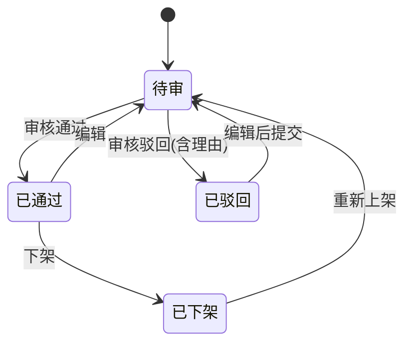
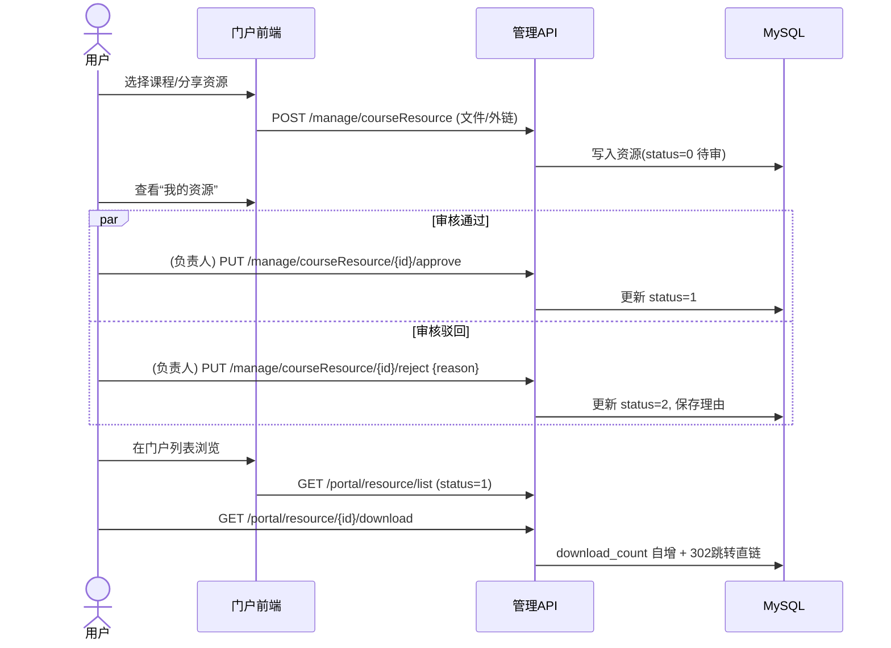

# 课程资源分享模块报告（v1）

更新时间：2025-10-18

## 概览
- 目标：提供“专业 → 课程 → 资源”的资料分享与审核发布能力；支持压缩包或外链；提供下载计数与排行榜。
- 架构：
  - 门户（/portal）：登录后查询与下载（只读）。
  - 后台（/manage）：上传/编辑/删除/审核/上下架（写操作，按钮权限控制）。
- 现状：MVP 已可用（上传/审核/状态流转/排行榜/后台管理页面/权限），文档与菜单手册齐备，前后端联调通过。

---

## 领域模型（ER）
```mermaid
erDiagram
  TB_MAJOR ||--o{ TB_COURSE : 包含
  TB_MAJOR ||--o{ TB_MAJOR_LEAD : 负责
  TB_COURSE ||--o{ TB_COURSE_RESOURCE : 拥有
  TB_COURSE_RESOURCE ||--o{ TB_COURSE_RESOURCE_LOG : 审计

  TB_MAJOR {
    BIGINT id PK
    VARCHAR major_name UK
    CHAR status
    VARCHAR remark
    AUDIT audit_fields
  }
  TB_COURSE {
    BIGINT id PK
    BIGINT major_id FK
    VARCHAR course_name UK(major_id,course_name)
    VARCHAR course_code
    CHAR status
    VARCHAR remark
    AUDIT audit_fields
  }
  TB_MAJOR_LEAD {
    BIGINT id PK
    BIGINT major_id FK
    BIGINT user_id
    VARCHAR remark
    AUDIT audit_fields
    UK(major_id,user_id)
  }
  TB_COURSE_RESOURCE {
    BIGINT id PK
    BIGINT major_id
    BIGINT course_id
    VARCHAR resource_name
    TINYINT resource_type // 0文件 1外链
    VARCHAR file_url
    VARCHAR file_hash
    BIGINT file_size
    VARCHAR link_url
    TEXT description
    TINYINT status // 0待审 1通过 2驳回 3下架
    VARCHAR audit_by
    DATETIME audit_time
    VARCHAR audit_reason
    DATETIME publish_time
    INT download_count
    DATETIME last_download_time
    BIGINT uploader_id
    VARCHAR uploader_name
    AUDIT audit_fields
    UK(course_id, resource_type, file_hash)
    UK(course_id, resource_type, link_url)
  }
  TB_COURSE_RESOURCE_LOG {
    BIGINT id PK
    BIGINT resource_id
    VARCHAR action
    BIGINT actor_id
    VARCHAR actor_name
    VARCHAR ip
    VARCHAR user_agent
    TEXT detail
    VARCHAR result
    AUDIT audit_fields
  }
```

---

## 状态与关键流程

### 状态机


### 审核/下载流程（时序）


---

## 权限说明（角色-操作矩阵）

- 角色：普通用户(user) / 专业负责人(major_lead) / 管理员(admin/super_admin)
- 门户查询：登录即可，无需 `manage:*` 权限；写操作统一走 `/manage` 且需按钮权限。

| 操作 | user | major_lead | admin/super_admin |
|---|---|---|---|
| 门户浏览/下载 | ✓ | ✓ | ✓ |
| 上传资源 | ✓(需 manage:upload:oss + add) | ✓ | ✓ |
| 编辑本人资源(转待审) | ✓(edit) | ✓ | ✓ |
| 删除本人资源 | ✓(remove，仅待审/驳回/下架) | ✓ | ✓ |
| 资源下架（他人） | × | ✓ | ✓ |
| 审核通过/驳回 | × | ✓ | ✓ |
| 负责人维护 | × | — | ✓（管理员配置负责人） |
| 专业/课程维护 | × | 课程（限本专业） | ✓ |

主要权限标识（示例）：
- 资源：`manage:courseResource:list|query|add|edit|remove|approve|reject|offline|online|download`
- 课程：`manage:course:list|query|add|edit|remove`
- 专业：`manage:major:list|query|add|edit|remove`
- 负责人：`manage:majorLead:list|add|remove`

---

## 接口与路由
- 门户（只读）：
  - GET `/portal/major/list`、`/portal/course/list`、`/portal/resource/list|{id}|{id}/download|/top`
- 后台（写操作）：
  - 专业：GET/POST/PUT/DELETE `/manage/major`
  - 课程：GET/POST/PUT/DELETE `/manage/course`
  - 资源：GET/POST/PUT/DELETE `/manage/courseResource` + 审核/上下架 `/approve|reject|offline|online`

排行榜：
- 门户 GET `/portal/resource/top?scope=global|major|course&days=7&limit=10`

---

## 后台菜单（课程资源模块）
- 目录：课程资源（路由：`/manage/course-resource`，组件：Layout）
- 子菜单（相对路由）：
  - 资源列表（已上架）：`approved` → 组件 `manage/courseResource/approved`
  - 待审核：`audit` → `manage/courseResource/audit`
  - 回收站：`trash` → `manage/courseResource/trash`
  - 专业管理：`major` → `manage/courseResource/major/index`
  - 课程管理：`course` → `manage/courseResource/course/index`
  - 专业负责人：`major-lead` → `manage/courseResource/majorLead/index`

---

## 数据与约束
- 去重：
  - 文件：(course_id, resource_type, file_hash) 唯一
  - 外链：(course_id, resource_type, link_url) 唯一（URL 规范化：去空格、去尾斜杠、小写域）
- 文件限制：仅 zip/rar/7z/tar/tar.gz/tar.bz2/tar.xz；≤100MB（前端+后端二次校验）
- 审计：`tb_course_resource_log` 记录 CREATE/EDIT/APPROVE/REJECT/OFFLINE/ONLINE/DOWNLOAD/DELETE/HARD_DELETE
- 权限校验：学生仅可删除本人且状态∈(待审/驳回/下架)；已通过需先下架；负责人/管理员可强制删除（仅删库）

---

## 已实现页面（摘）
- 门户：专业卡片 / 课程卡片（课程名模糊） / 资源列表（上传） / 我的资源 / 排行榜
- 后台：待审核（专业下拉+课程名模糊）/ 已上架（专业下拉+课程名模糊）/ 回收站（专业下拉）/ 专业管理 / 课程管理 / 专业负责人

---

## 测试覆盖
- 门户链路：登录 → 门户查询 → 上传 → 待审 → 审核通过/驳回 → 列表可见 → 下载计数
- 后台链路：
  - 审核：待审列表 → 通过/驳回 → 状态变更
  - 上下架：已上架下架 → 回收站重新上架（转待审）
  - 基础数据：专业/课程/负责人增删改查
- 单元测试（服务层示例）：创建即待审、学生删除已通过被拒、审核通过与驳回日志写入

---

## 已知限制与后续迭代
- 回收站列表当前前端两次查询合并；建议服务端支持 status IN 查询并分页返回
- 专业/课程下拉建议支持远程搜索/分页
- 排行榜建议引入 Redis 缓存（5 分钟）
- 下载防刷：后续引入最小间隔与限流
- 更细权限：负责人范围二次校验（资源列表按负责人专业过滤）

---

## 部署与配置要点
- 前端：`.env.*` 设置 `VITE_APP_BASE_API=/dev-api`
- OSS：凭据走环境变量/本地私密文件；不入库/不入 Git
- 登录：门户与后台均需登录；按钮权限决定写操作

---

## 结论
- MVP 达成：上传/审核/状态流转/排行榜/后台管理与权限/文档与手册已就位，可验收。
- 建议先按“回收站服务端化 + 排行榜缓存 + 负责人范围过滤”排期下一迭代。
