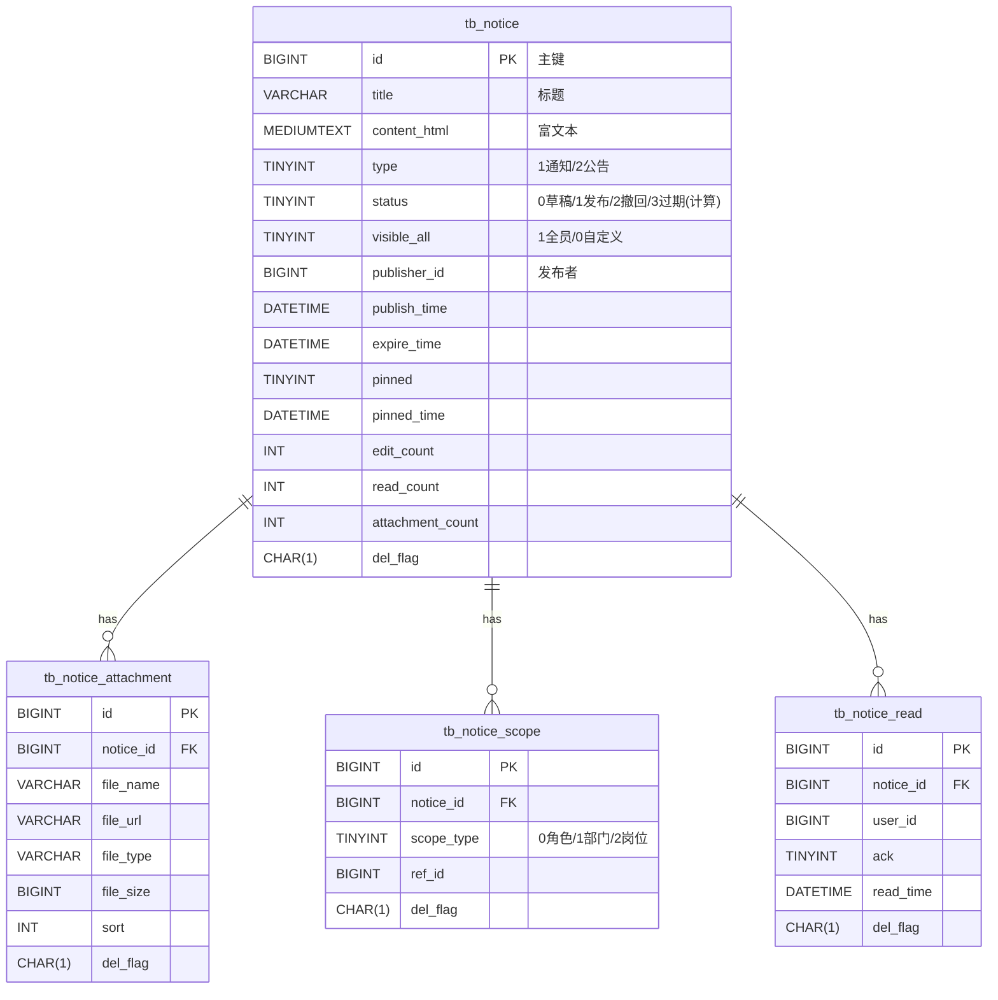
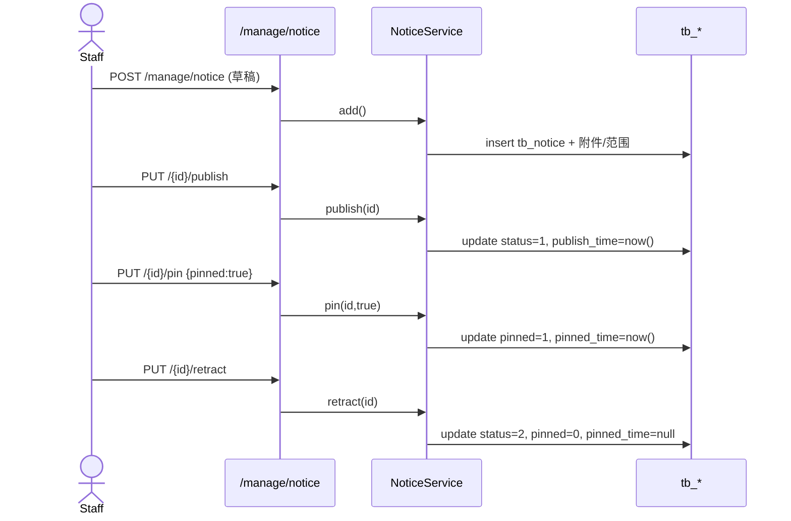
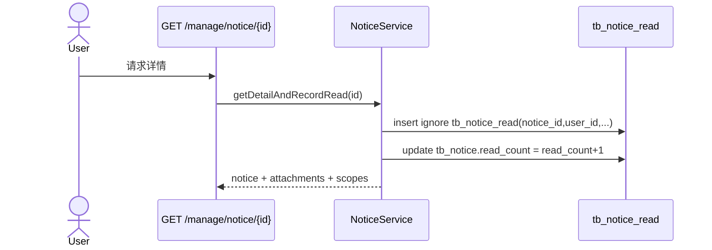

## 概览
- 模块：通知公告（MVP）
- 目标：支持公告发布/撤回、置顶、有效期与可见范围（全员/角色/部门/岗位），并记录阅读回执。
- 角色与权限：
  - user/librarian/major_lead：只读（list/get）
  - staff：增改删/发布/置顶（add/edit/remove/publish/pin）
  - admin/super_admin：全部

## 领域模型

## 关键流程
### 发布 / 置顶 / 撤回

### 阅读回执

## 权限说明
- 接口与按钮对齐：
  - manage:notice:list, manage:notice:get
  - manage:notice:add, manage:notice:edit, manage:notice:remove
  - manage:notice:publish, manage:notice:pin
- 列表过滤：
  - 默认：非管理员仅返回可见范围匹配且未过期的“已发布”。
  - 选择“全部”时：非管理员仅返回“所有已发布 + 本人草稿/撤回”。
  - 门户：支持关键词、是否包含过期、已读/未读筛选与按发布/更新/过期时间排序。

## 已知限制与后续计划
- 审批流/定时发布：后续版本支持。
- “确认已读”回执（ack=1）：MVP 未启用，已预留字段。
- 富文本图片直传：当前通过外链/OSS 后续增强压缩与鉴黄。
- 查询性能：大规模范围匹配可引入缓存与物化视图方案。

## 自检
- 表：tb_notice/tb_notice_scope/tb_notice_attachment/tb_notice_read 已在 book-mis.sql 创建并含示例数据。
- 文档：docs/api/通知公告.md、docs/apifox/通知公告.md 完整可用。
- 后端：接口/权限/事务齐备；置顶、发布、撤回齐全。
- 测试：权限注解/服务方法（成功/失败）已覆盖。
