## 概览
- 模块：通知公告（MVP 完成）
- 目标：支持公告发布/撤回、置顶、有效期与可见范围（全员/角色/部门/岗位），并记录阅读回执；门户与管理后台一致可用。
- 近期增强：
  - 列表支持“状态=全部(-1)”视角（非管理员=所有已发布+本人草稿/撤回）。
  - 新增筛选：已读/未读；新增排序：按发布/更新/过期时间（置顶始终优先）。
  - 撤回自动取消置顶；阅读计数幂等（同一用户仅首次计数）。

## 领域模型

```mermaid
erDiagram
  tb_notice ||--o{ tb_notice_attachment : has
  tb_notice ||--o{ tb_notice_scope : has
  tb_notice ||--o{ tb_notice_read : has

  tb_notice {
    BIGINT id PK "主键"
    VARCHAR title "标题"
    MEDIUMTEXT content_html "富文本"
    TINYINT type "1通知/2公告"
    TINYINT status "0草稿/1发布/2撤回/3过期(计算)"
    TINYINT visible_all "1全员/0自定义"
    BIGINT publisher_id "发布者"
    DATETIME publish_time
    DATETIME expire_time
    TINYINT pinned
    DATETIME pinned_time
    INT edit_count
    INT read_count
    INT attachment_count
    CHAR(1) del_flag
  }

  tb_notice_attachment {
    BIGINT id PK
    BIGINT notice_id FK
    VARCHAR file_name
    VARCHAR file_url
    VARCHAR file_type
    BIGINT file_size
    INT sort
    CHAR(1) del_flag
  }

  tb_notice_scope {
    BIGINT id PK
    BIGINT notice_id FK
    TINYINT scope_type "0角色/1部门/2岗位"
    BIGINT ref_id
    CHAR(1) del_flag
  }

  tb_notice_read {
    BIGINT id PK
    BIGINT notice_id FK
    BIGINT user_id
    TINYINT ack
    DATETIME read_time
    CHAR(1) del_flag
  }
```


## 关键流程
### 发布 / 置顶 / 撤回


### 阅读回执


### 列表查询（门户/管理）
```mermaid
flowchart TD
  A[入参 keyword/status/pinned/includeExpired\n     read/orderBy/orderDir] --> B{isAdmin?}
  B -- 否 --> C[非管理员过滤]
  C --> C1[状态=-1: 已发布 OR 发布者本人]
  C --> C2[状态≠-1: 若≠已发布 则限制为发布者本人]
  C --> C3[可见范围: 全员 OR 角色/部门/岗位 任一命中]
  C --> C4[过期: 默认过滤; includeExpired=true 时放开]
  B -- 是 --> D[管理员不过滤可见范围]
  D --> E[排序: pinned desc, pinned_time desc,\n           {publish|update|expire}_time {asc|desc}]
  C4 --> E
  C1 --> E
  C2 --> E
```

## 权限说明
- 接口与按钮对齐：
  - manage:notice:list, manage:notice:get
  - manage:notice:add, manage:notice:edit, manage:notice:remove
  - manage:notice:publish, manage:notice:pin
- 列表过滤：
  - 默认：非管理员仅返回可见范围匹配且未过期的“已发布”。
  - 选择“全部”时：非管理员仅返回“所有已发布 + 本人草稿/撤回”。
  - 门户：支持关键词、是否包含过期、已读/未读筛选与按发布/更新/过期时间排序。

## 已知限制与后续计划
- 审批流/定时发布：后续版本支持。
- “确认已读”回执（ack=1）：MVP 未启用，已预留字段。
- 富文本图片直传：当前通过外链/OSS 后续增强压缩与鉴黄。
- 查询性能：大规模范围匹配可引入缓存与物化视图方案。
 - 附件归档：当前“编辑时附件覆盖重建”；如需“归档不删除”，可将附件改为软删并在查询中过滤 `del_flag='0'`。

## 自检
- 表：tb_notice/tb_notice_scope/tb_notice_attachment/tb_notice_read 已在 book-mis.sql 创建并含示例数据。
- 文档：docs/api/通知公告.md、docs/apifox/通知公告.md 完整可用。
- 后端：接口/权限/事务齐备；置顶、发布、撤回齐全。
- 测试：
  - 权限注解检查：backend/ruoyi-manage/src/test/java/com/ruoyi/manage/controller/NoticeControllerAuthTest.java
  - 服务幂等/冲突/阅读计数：backend/ruoyi-manage/src/test/java/com/ruoyi/manage/service/NoticeServiceImplTest.java
  - 控制器返回码映射：backend/ruoyi-manage/src/test/java/com/ruoyi/manage/controller/NoticeControllerResultCodeTest.java

## 前端概览
- 管理端：列表“状态=全部(-1)”默认；发布/撤回/置顶、批量删除、详情抽屉；保存后引导发布；编辑页支持可见范围与附件（OSS/URL）。
- 门户端：高信息密度表格（标题/置顶/过期/过期时间/已读/发布时间/更新时间/编辑次数/阅读次数）；关键词、包含过期、已读/未读筛选与排序；详情抽屉记录已读。

## 菜单与路由对齐
- 目录：通知管理 → 路由地址 `/manage/notice`
- 菜单：公告管理 → 路由地址 `index`，组件路径 `manage/notice/index`
- 隐藏：公告编辑 → 路由地址 `edit`，组件路径 `manage/notice/edit`
- 详见：docs/ruoyi-opt/通知公告-菜单与权限.md
