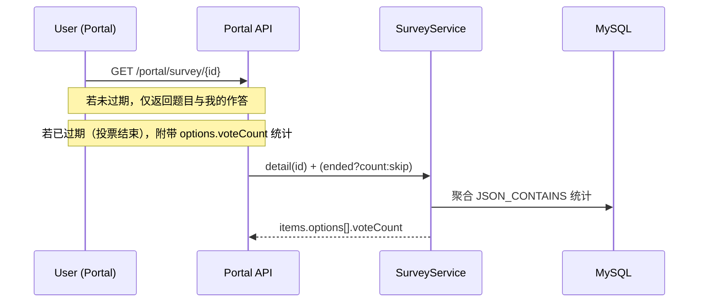

# 模块报告：问卷（表单收集）

## 领域模型

- tb_survey：问卷头（标题、状态、截止、可见范围）。
- tb_survey_item：题目（题干、题型、是否必填、排序）。
- tb_survey_option：选项（仅用于单/多选）。
- tb_survey_scope：可见范围（角色/部门/岗位并集）。
- tb_survey_answer：用户答卷（单人单份、可覆盖）。
- tb_survey_answer_item：答案明细（文本或选项ID集合）。

## 关键流程

### 填写与提交

### 结果展示（投票）

### 管理：归档与延期

### 状态流转与置顶

## 权限说明
- 管理侧：`manage:survey:list|query|add|edit|publish|archive|extend|pin`
- 门户侧：需登录。

## 已知限制与风险
- 管理端“可见范围选择器”界面暂简化；后端已支持 role/dept/post 三类范围。
- 已提供基础的选项票数统计：
  - 管理端详情实时显示票数与柱状图；
  - 门户仅在投票结束（过期或归档）后显示柱状图。
- 题型仅支持文本/单选/多选，文件/时间等类型需二期扩展。
- 草稿态允许编辑；发布后不可编辑题目结构。门户仅展示发布态；已过期问卷自动取消置顶。

## 后续计划
- 导出报表与统计图表。
- 管理端可见范围选择器（角色/部门/岗位三级选择）。
- 支持文件上传题、日期时间题、分段页、跳题逻辑等增强。
