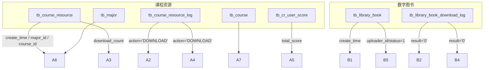
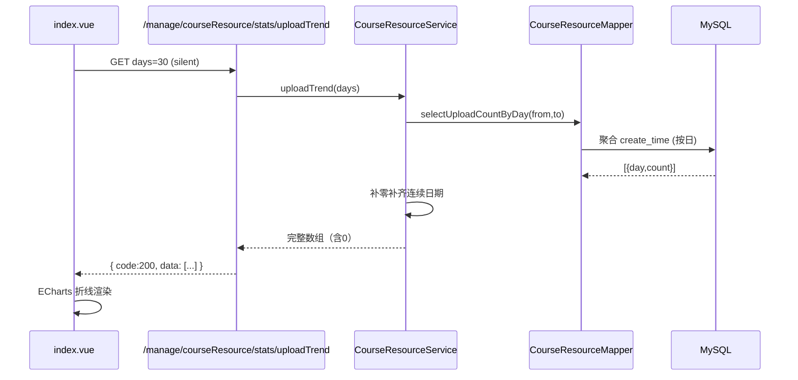
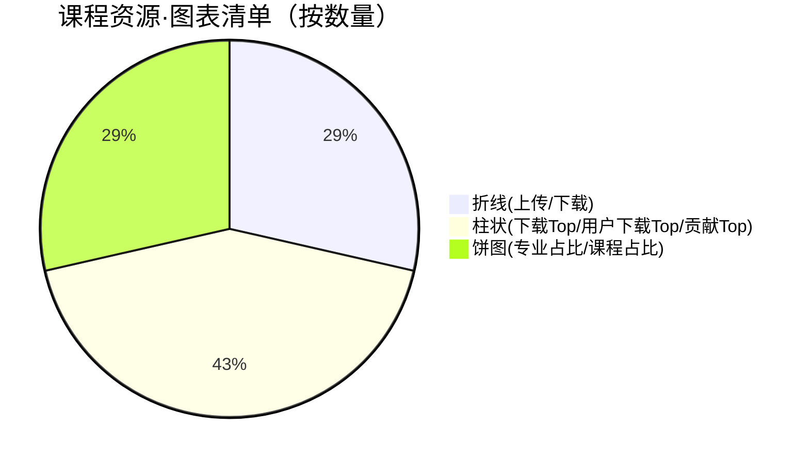
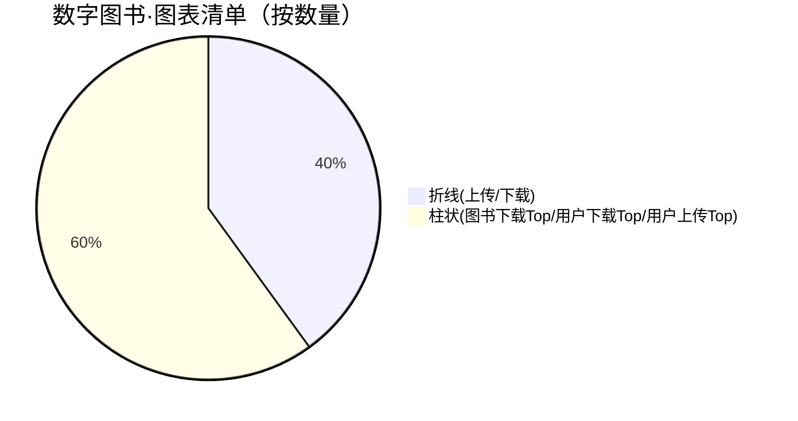

# 首页数据报表可视化改造报告（MVP）

更新时间：2025-11-08

## 1. 概述
- 目标：在管理端首页（`/index`）提供跨模块的数据可视化大屏，覆盖“课程资源分享、数字图书馆”等模块的最近趋势、排行与结构占比，面向所有已登录后台用户可见。
- 范围：仅涉及前端首页视图与统计类接口（不改变业务写操作）；保持对 RuoYi 的弱依赖，权限统一放宽为“登录可见”。

## 2. 交付清单
- 首页可视化
  - 课程资源分享
    - 折线：近 N 天上传趋势、近 N 天下载趋势（N=7/30/90）
    - 柱状：下载榜 Top5、用户下载榜 Top5
    - 柱状（底部）：用户贡献榜 Top5（积分）
    - 饼图（底部）：上传·专业占比（近30天）、上传·课程占比（近30天）
  - 数字图书馆
    - 折线：近 N 天上传趋势、近 N 天下载趋势（N=7/30/90）
    - 柱状：下载榜 Top5、用户下载榜 Top5
    - 柱状（底部并排）：用户上传榜 Top5（通过上架数量）
- 布局优化
  - 所有模块“上传/下载”并排呈现；“快捷操作”卡片上移至首页第一行；排行与占比分层分区展示。
- 权限放宽
  - 所有统计接口统一使用 `isAuthenticated()`，只要登录后台即可查看报表。

## 3. 架构与数据流

```mermaid
flowchart LR
  FE[前端 index.vue / ECharts] -->|Axios (silent)| API[/管理端统计接口/]
  subgraph API-课程资源
    A1[/GET /manage/courseResource/stats/uploadTrend/]
    A2[/GET /manage/courseResource/stats/downloadTrend/]
    A3[/GET /manage/courseResource/stats/topResources/]
    A4[/GET /manage/courseResource/stats/topDownloadUsers/]
    A5[/GET /manage/courseResource/stats/topScoreUsers/]
    A6[/GET /manage/courseResource/stats/majorShare/]
    A7[/GET /manage/courseResource/stats/courseShare/]
  end
  subgraph API-数字图书
    B1[/GET /manage/library/stats/uploadTrend/]
    B2[/GET /manage/library/stats/downloadTrend/]
    B3[/GET /manage/library/stats/topBooks/]
    B4[/GET /manage/library/stats/topDownloadUsers/]
    B5[/GET /manage/library/stats/topUploadUsers/]
  end
  API --> SVC[Service + Mapper]
  SVC --> DB[(MySQL)]
```

### 3.1 主要表与读路径



### 3.2 典型时序：课程资源上传趋势



## 4. 接口与权限

- 课程资源分享（均为登录可见 isAuthenticated）
  - GET `/manage/courseResource/stats/uploadTrend` | `/downloadTrend`
  - GET `/manage/courseResource/stats/topResources` | `topDownloadUsers` | `topScoreUsers`
  - GET `/manage/courseResource/stats/majorShare` | `/courseShare`
- 数字图书馆（均为登录可见 isAuthenticated）
  - GET `/manage/library/stats/uploadTrend` | `/downloadTrend`
  - GET `/manage/library/stats/topBooks` | `topDownloadUsers` | `topUploadUsers`

备注：统计接口放宽至“登录可见”，无需在菜单中新增按钮权限；页面使用 `silent` 请求，异常不弹窗但图表会清空。

## 5. 前端实现要点

- 样式与布局
  - 并排：上传/下载趋势并行展示；排行并行展示；底部饼图并行展示。
  - “快捷操作”集成至首页第一行的第4个卡片，包含“刷新”与快速入口。
- 组件与代码位置
  - 视图：`frontend/src/views/index.vue`
  - API：
    - 课程资源：`frontend/src/api/manage/courseResource.js`
    - 数字图书：`frontend/src/api/manage/library.js`
- 交互与容错
  - `silent` 请求：401/403/5xx 不打断页面，仅清空图表，避免干扰仪表盘。
  - `resize/onBeforeUnmount`：ECharts 实例统一销毁与自适应。
  - 趋势图支持 7/30/90 快切；排行与饼图默认 30 天（后续可扩展）。

## 6. 可视化清单与映射





## 7. 性能与安全
- 性能
  - 所有统计 SQL 为聚合只读，走必要索引（按时间范围过滤/按外键分组）；趋势结果在 Service 层“按天补零”避免二次前端处理。
  - ECharts 实例复用与延迟销毁；窗口 resize 合并处理。
- 安全
  - 统计接口仅返回聚合，未暴露敏感字段。
  - 统一 `isAuthenticated()`；如需“更细粒度”可恢复按钮权限（`manage:<module>:stats`）。

## 8. 测试与验证
- 基础用例（Apifox 已更新对应指南）：
  - 趋势：`/stats/uploadTrend?days=7|30|90` → `code=200 && data:数组`
  - 排行：下载Top/用户下载Top/用户上传Top/用户积分Top → `code=200 && data:数组`
  - 占比：`/stats/majorShare|courseShare?days=30` → `code=200 && data:数组`
- 页面自检：
  - 无数据时图表轴线存在且曲线为0，饼图空集合时清空。
  - 401 时静默；登录后刷新恢复。

## 9. 后台操作要点
- 无需新增统计按钮权限；确保用户可登录管理后台。
- 如需限制特定角色可见：可将统计接口改回 `@PreAuthorize("@ss.hasPermi('manage:<module>:stats')")`，并在“菜单管理”中新建相应按钮权限分配给角色。

## 10. 已知限制与后续计划
- 已知限制
  - 排行与占比默认时间窗口固定（30天），未实现 UI 级切换。
  - 未加缓存（Redis），高并发场景下会直查 DB（当前聚合轻量问题不大）。
  - 趋势与排行仅采用“按天”与“TopN”聚合，未提供导出与更多维度过滤。
- 迭代建议
  1) 为排行与占比补充 7/30/90 切换；支持“专业/课程”维度过滤器。
  2) 引入 Redis 缓存与定时预计算（key 前缀：`app:stats:*`），降低高峰时查询压力。
  3) 增加骨架屏/占位提示（无数据/无权限）以提升可感知反馈。
  4) 统一 ECharts 主题（深浅主题自适配），抽象图表渲染工具函数。
  5) 接入监控埋点（加载时延、错误率），辅助运维观测。

## 11. 代码参考（关键文件）
- 前端
  - 首页视图：`frontend/src/views/index.vue`
  - 课程资源 API：`frontend/src/api/manage/courseResource.js`
  - 数字图书 API：`frontend/src/api/manage/library.js`
- 后端（ruoyi-manage）
  - 课程资源统计 Controller：`backend/ruoyi-manage/src/main/java/com/ruoyi/manage/controller/CourseResourceController.java`
  - 数字图书统计 Controller：`backend/ruoyi-manage/src/main/java/com/ruoyi/manage/controller/LibraryController.java`
  - Service：`.../service/impl/CourseResourceServiceImpl.java`、`.../LibraryServiceImpl.java`、`.../ScoreServiceImpl.java`
  - Mapper XML：
    - 课程资源：`.../resources/mapper/manage/CourseResourceMapper.xml`、`CourseResourceLogMapper.xml`
    - 数字图书：`.../resources/mapper/manage/LibraryMapper.xml`、`LibraryDownloadLogMapper.xml`

---
若需我为排行/占比补充“天数切换器”与“筛选器”，可在本报告对应迭代项的基础上继续实现。

