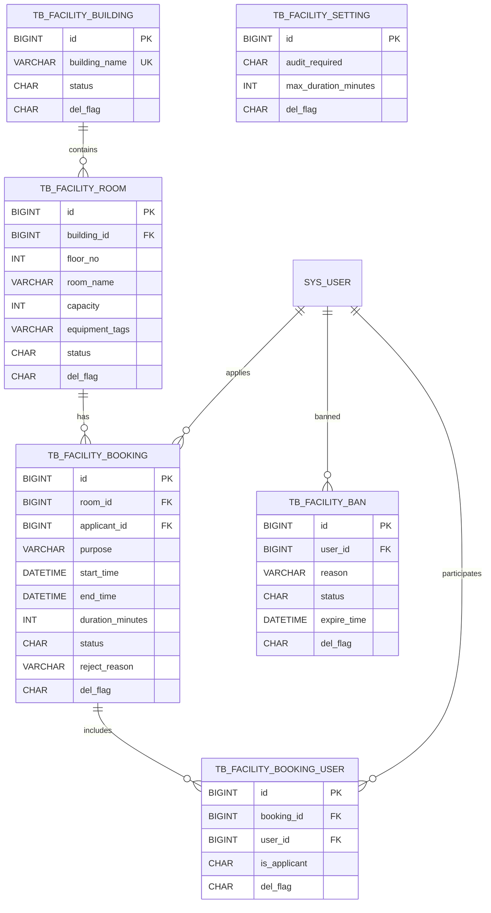

# 功能房预约模块 — 数据模型介绍（v1，MVP）

> 依据本仓库最新 DDL 与草案归纳：
>
> - 标准 DDL：`docs/sql/功能房预约-DDL.md`
> - 草案汇总：`book-mis.sql`
> - 日期：2025-11-04（含此前约定）
>
> 约定：不建物理外键，使用“逻辑外键 + 必要索引”；审计与软删字段统一；时间冲突由业务层依据状态集（pending/approved/ongoing）判定。

---

## 模块概览

- 业务目标：管理“功能房（会议室/报告厅/研讨室等）”的预约、审核与使用，支持按楼房/楼层/房间组织、冲突校验、使用人列表、封禁与全局配置。
- 核心对象：楼房（tb_facility_building）、功能房（tb_facility_room）、预约（tb_facility_booking）、预约参与人（tb_facility_booking_user）、全局设置（tb_facility_setting）、申请人封禁（tb_facility_ban）。
- 冲突与幂等：新增预约需对同一房间在 [start_time, end_time) 进行“重叠冲突”判断（对 pending/approved/ongoing 生效）；并通过 `(room_id, applicant_id, start_time, end_time)` 唯一键防止重复提交。
- 审核与状态：是否需要审核由全局设置 `audit_required` 控制；状态流转：0-待审 1-已批准 2-已驳回 3-已取消 4-进行中 5-已完成。
- 时长与粒度：默认最长 4320 分钟（72 小时）；时间粒度建议 30 分钟（由前端/服务侧校验）。

---

## 关系图（ER 概览）



> 注：与 `sys_user` 的引用均为逻辑外键，由应用层与索引保证一致性。

---

## 表与字段详解（逐表）

### 1) tb_facility_building（楼房表）
- 用途：功能房的上级维度，统一命名与启停用控制。
- 关键约束与索引：
  - PK：`id`
  - UK：`uk_building_name(building_name)` — 楼房名称全局唯一。
- 字段说明：
  - `id` BIGINT PK — 楼房主键。
  - `building_name` VARCHAR(128) NOT NULL — 楼房名称（唯一）。
  - `status` CHAR(1) DEFAULT '0' — 0-正常 1-停用（停用则其下房间默认不可用，业务可联动）。
  - `remark` VARCHAR(500) — 备注。
  - `create_by/create_time/update_by/update_time/del_flag` — 审计与软删。
- 关联：被 `tb_facility_room.building_id` 逻辑引用（一对多）。

### 2) tb_facility_room（功能房表）
- 用途：定义可预约的具体房间，含楼层、容量与设备标签。
- 关键约束与索引：
  - PK：`id`
  - UK：`uk_room_name(building_id, floor_no, room_name)` — 同楼房同楼层房间名唯一。
  - IDX：`idx_room_building_floor(building_id, floor_no)`、`idx_room_status(status)`。
- 字段说明：
  - `id` BIGINT PK — 房间主键。
  - `building_id` BIGINT NOT NULL — 楼房ID（逻辑外键：tb_facility_building.id）。
  - `floor_no` INT NOT NULL — 楼层（可为负数代表地下一层）。
  - `room_name` VARCHAR(128) NOT NULL — 房间名称/编号。
  - `capacity` INT — 容量（人数）。
  - `equipment_tags` VARCHAR(255) — 设备/标签（逗号分隔，如“投影,白板”）。
  - `status` CHAR(1) DEFAULT '0' — 0-启用 1-禁用。
  - `remark` + 审计与软删字段。
- 关联：被 `tb_facility_booking.room_id` 逻辑引用（一对多）。
- 标签说明：
  - MVP 采用逗号分隔存储；若后续需要标签筛选性能/准确性，建议演进为“房间-标签”映射表。

### 3) tb_facility_booking（功能房预约表）
- 用途：记录预约单，含申请人、时间段、目的、时长与状态。
- 关键约束与索引：
  - PK：`id`
  - UK：`uk_booking_once(room_id, applicant_id, start_time, end_time)` — 幂等唯一键（防重复提交）。
  - IDX：`idx_booking_room_time(room_id, start_time, end_time)` — 冲突判定常用；
         `idx_booking_applicant_time(applicant_id, start_time)` — 个人预约查询；
         `idx_booking_status(status)` — 审核/队列。
- 字段说明：
  - `id` BIGINT PK — 预约主键。
  - `room_id` BIGINT NOT NULL — 房间ID（逻辑外键：tb_facility_room.id）。
  - `applicant_id` BIGINT NOT NULL — 申请人用户ID（逻辑外键：sys_user.user_id）。
  - `purpose` VARCHAR(200) NOT NULL — 使用目的（1~200字）。
  - `start_time` DATETIME NOT NULL — 开始时间（建议 30 分钟粒度）。
  - `end_time` DATETIME NOT NULL — 结束时间（大于开始且不超过全局上限）。
  - `duration_minutes` INT NOT NULL — 时长（分钟）。
  - `status` CHAR(1) DEFAULT '0' — 0待审 1已批准 2已驳回 3已取消 4进行中 5已完成。
  - `reject_reason` VARCHAR(500) — 驳回理由（处于“驳回”时必填）。
  - 审计与软删字段。
- 冲突范围（业务约定）：
  - 判定集合：与房间内状态∈{0待审, 1已批准, 4进行中} 的预约进行时间重叠检测；2/3/5 不参与冲突。
  - 时间重叠规则：`(start_time < :newEnd) AND (end_time > :newStart)`。

### 4) tb_facility_booking_user（预约使用人关联表）
- 用途：记录参与使用的人员清单，含是否为申请人标记；便于签到/统计。
- 关键约束与索引：
  - PK：`id`
  - UK：`uk_booking_user(booking_id, user_id)` — 同一预约下同一用户仅一条记录。
  - IDX：`idx_booking_user_user(user_id)` — 用户参与的预约。
- 字段说明：
  - `id` BIGINT PK — 主键。
  - `booking_id` BIGINT NOT NULL — 预约ID（逻辑外键：tb_facility_booking.id）。
  - `user_id` BIGINT NOT NULL — 用户ID（逻辑外键：sys_user.user_id）。
  - `is_applicant` CHAR(1) DEFAULT '0' — 是否申请人：1是 0否（申请人也需入表）。
  - 审计与软删字段。
- 业务约定：
  - “至少 3 人（含申请人）”为业务规则，由服务侧校验；超容量提示 `capacity` 上限。

### 5) tb_facility_setting（功能房模块设置）
- 用途：全局配置单表（建议固定 id=1），控制审核开关与最长时长。
- 字段说明：
  - `id` BIGINT PK — 主键（建议固定 1）。
  - `audit_required` CHAR(1) DEFAULT '1' — 是否需要审核：1是 0否。
  - `max_duration_minutes` INT DEFAULT 4320 — 最长使用时长（分钟，默认 72 小时）。
  - `remark` + 审计与软删字段。

### 6) tb_facility_ban（申请人封禁表）
- 用途：限制某用户作为“申请人”提交预约（仍允许其作为使用人参与）。
- 关键约束与索引：
  - PK：`id`
  - UK：`uk_ban_user_status(user_id, status)` — 保证同一用户仅有一条生效记录（status=0）。
  - IDX：`idx_ban_user(user_id)`。
- 字段说明：
  - `id` BIGINT PK — 主键。
  - `user_id` BIGINT NOT NULL — 用户ID（逻辑外键：sys_user.user_id）。
  - `reason` VARCHAR(500) NOT NULL — 封禁原因。
  - `status` CHAR(1) DEFAULT '0' — 0生效 1失效。
  - `expire_time` DATETIME — 到期时间（可空，空表示永久/人工解封）。
  - 审计与软删字段。
- 生效判定（应用层）：
  - 存在 `status=0 AND del_flag='0' AND (expire_time IS NULL OR expire_time > NOW())` 视为封禁生效。

---

## 枚举与状态
- 楼房/功能房 `status`：'0'=正常/启用、'1'=停用/禁用。
- 预约 `status`：'0'=待审、'1'=已批准、'2'=已驳回、'3'=已取消、'4'=进行中、'5'=已完成。
- 封禁 `status`：'0'=生效、'1'=失效。
- 预约人关联 `is_applicant`：'1'=是、'0'=否。
- 软删 `del_flag`：'0'=存在、'2'=删除。

---

## 典型查询与用法示例

- 新增预约前的时间冲突检测：
```sql
SELECT 1
FROM tb_facility_booking b
WHERE b.del_flag='0'
  AND b.room_id = :roomId
  AND b.status IN ('0','1','4')
  AND b.start_time < :newEnd
  AND b.end_time   > :newStart
LIMIT 1;
```

- 预约创建（幂等唯一键避免重复）：
```sql
INSERT INTO tb_facility_booking(room_id, applicant_id, purpose, start_time, end_time, duration_minutes, status, create_by, update_by)
VALUES(:roomId, :uid, :purpose, :start, :end, :duration, :initStatus, :uname, :uname);
-- 若遇到唯一键冲突 uk_booking_once，提示用户“已提交相同时间段申请”。
```

- 将到点的预约标记为“进行中/已完成”（批处理示例）：
```sql
-- 进行中：已批准且当前处于时间段内
UPDATE tb_facility_booking
SET status='4', update_by='system', update_time=NOW()
WHERE status='1' AND start_time<=NOW() AND end_time>NOW() AND del_flag='0';

-- 已完成：进行中且已超出结束时间
UPDATE tb_facility_booking
SET status='5', update_by='system', update_time=NOW()
WHERE status='4' AND end_time<=NOW() AND del_flag='0';
```

- 查询某房间日历（包含 pending/approved/ongoing）：
```sql
SELECT id, start_time, end_time, status
FROM tb_facility_booking
WHERE room_id=:roomId AND del_flag='0' AND status IN ('0','1','4')
  AND start_time < :dayEnd AND end_time > :dayStart
ORDER BY start_time;
```

- 按条件筛选房间（容量与设备标签）：
```sql
SELECT r.*
FROM tb_facility_room r
JOIN tb_facility_building b ON b.id=r.building_id AND b.del_flag='0' AND b.status='0'
WHERE r.del_flag='0' AND r.status='0'
  AND (:minCap IS NULL OR r.capacity >= :minCap)
  AND (:tag IS NULL OR FIND_IN_SET(:tag, REPLACE(r.equipment_tags,'，',',')))
ORDER BY b.building_name, r.floor_no, r.room_name;
```

- 检查申请人是否被封禁：
```sql
SELECT 1
FROM tb_facility_ban
WHERE del_flag='0' AND user_id=:uid AND status='0'
  AND (expire_time IS NULL OR expire_time > NOW())
LIMIT 1;
```

---

## 设计要点与实现建议
- 冲突与事务：
  - 先查冲突再写入，并在同一事务中再做一次“基于索引”的冲突确认（防竞态）。
  - 对批准操作务必再做一次冲突校验，避免两个待审同时被批准而产生重叠。
- 审核开关：
  - `audit_required=1` 时新建为“0待审”；为 `0` 时可直接进入“1已批准”。
- 状态联动：
  - 定时任务或接口懒更新将“1已批准→4进行中→5已完成”。取消/驳回不参与冲突集。
- 参与人数：
  - 至少 3 人（含申请人）由服务侧校验；并校验不超过房间 `capacity`。
- 标签与检索：
  - MVP 采用 `equipment_tags` 逗号分隔；后续可拆为“房间-标签”映射提升查询准确性。
- 一致性与外键策略：
  - 采用逻辑外键与必要索引，避免跨库/演进时的硬约束成本。
  - 变更楼房/房间状态时，可加联动校验阻止新预约或提示。

---

## 建表顺序与示例数据
- 建表顺序：`tb_facility_building` → `tb_facility_room` → `tb_facility_setting` → `tb_facility_booking` → `tb_facility_booking_user` → `tb_facility_ban`。
- 示例数据：见 `docs/sql/功能房预约-DDL.md` 末尾的示例插入（包含楼房/房间/设置/预约/参与人）。

---

## 版本记录
- 2025-11-04：首版（楼房/房间/预约/参与人/设置/封禁）与索引、唯一键、冲突判断规则。

> 注：本文件为模型解释文档，标准 DDL 以 `docs/sql/功能房预约-DDL.md` 为准；如有差异，以 DDL 为最终依据。

