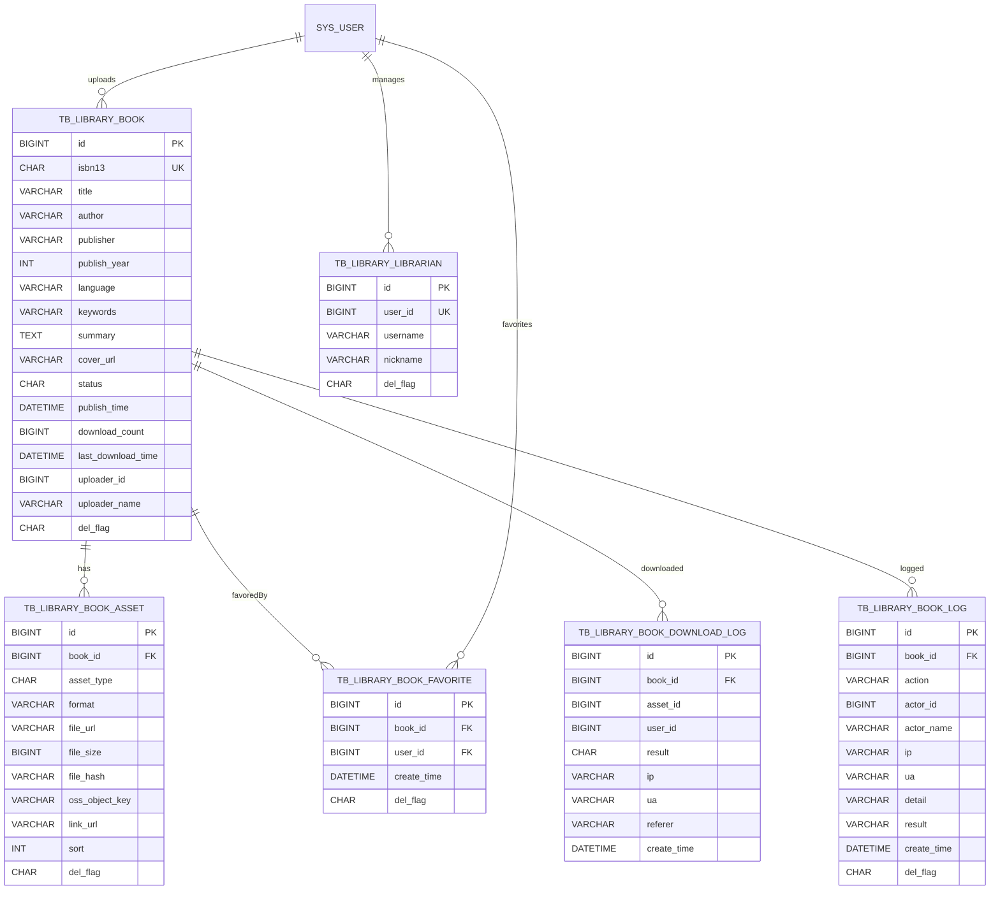

# 数字图书馆模块 — 数据模型介绍（v3 最终版）

> 依据本仓库最新 DDL 与草案归纳：
>
> - 标准 DDL：`docs/sql/数字图书馆-DDL.md`
> - 草案汇总：`book-mis.sql`
> - 日期：2025-11-03（结构修订 v3）
>
> 约定：ISBN 仅存数字字符串（ISBN-13）；搜索以 `title/author` 为主，`keywords` 作为辅助；下载计数建议接口侧 Redis 聚合后回写。

---

## 模块概览

- 业务目标：集中管理电子书与资料（多格式或外链），支持上传审核、搜索、收藏、下载日志与审计；由图书管理员进行审核与运维。
- 核心对象：图书主体（tb_library_book）、书籍资产（tb_library_book_asset）、收藏关系（tb_library_book_favorite）、下载日志（tb_library_book_download_log）、操作日志（tb_library_book_log）、管理员映射（tb_library_librarian）。
- 资产形态：支持文件（OSS）或外链；同一本书可挂多条资产（如 pdf/epub/链接），排序控制下载优先级。
- 审核/状态：0-待审 1-已通过 2-驳回 3-已下架；通过后写入 `publish_time`；下载日志独立记录。

---

## 关系图（ER 概览）



> 注：本模块 DDL 中对部分表使用了数据库外键（CASCADE）以便随书籍删除自动清理资产/收藏；其他与用户的关系仍为逻辑外键。

---

## 表与字段详解（逐表）

### 1) tb_library_book（数字图书馆-图书主体）
- 用途：承载一本书的元数据、审核状态与下载计数。
- 关键约束与索引：
  - PK：`id`
  - UK：`uk_isbn13(isbn13)` — ISBN-13 全局唯一（仅数字）。
  - IDX：`idx_status_publish(status, publish_time)`、`idx_title(title)`、`idx_author(author)`。
- 字段说明：
  - `isbn13` CHAR(13) NOT NULL — 仅数字的 ISBN-13，作为唯一业务键（展示层如需连字符自行格式化）。
  - `title` / `author` / `publisher` / `publish_year` / `language` / `keywords` / `summary` / `cover_url` — 基础元数据；`keywords` 逗号分隔。
  - `status` CHAR(1) DEFAULT '0' — 审核状态：0待审 1已通过 2驳回 3已下架。
  - `audit_by`/`audit_time`/`audit_reason` — 审核信息（仅审核动作更新）。
  - `publish_time` DATETIME — 首次发布（从待审/驳回转为已通过时写入）。
  - `download_count` BIGINT DEFAULT 0 / `last_download_time` DATETIME — 下载统计（建议 Redis 聚合落库）。
  - `uploader_id` BIGINT / `uploader_name` VARCHAR(64) — 上传者（逻辑外键 sys_user，冗余用户名）。
  - 审计/软删：`create_by/create_time/update_by/update_time/del_flag`。
- 约定与建议：
  - 搜索优先使用 `title/author` 前缀或模糊；`keywords` 用于二次过滤。
  - 下载榜/新上架榜分别基于 `download_count`、`publish_time`。

### 2) tb_library_book_asset（数字图书馆-图书资产）
- 用途：挂载书籍的文件或外链，支持多条资产与排序（下载优先）。
- 关键约束与索引：
  - PK：`id`
  - FK：`book_id → tb_library_book.id ON DELETE CASCADE`。
  - UK：`uk_library_book_file(book_id, asset_type, format, file_hash)` — 文件幂等去重；
        `uk_library_book_link(book_id, asset_type, link_url)` — 外链幂等去重。
  - IDX：`idx_book_id(book_id)`。
- 字段说明：
  - `asset_type` CHAR(1) NOT NULL — 0文件 1外链。
  - `format` VARCHAR(16) — 文件格式（pdf/epub/mobi/zip/other）。
  - `file_url` VARCHAR(512) / `file_size` / `file_hash` / `oss_object_key` — 文件访问与管理字段；`file_hash` 建议 SHA-256。
  - `link_url` VARCHAR(512) — 外链 URL。
  - `sort` INT — 下载/展示优先级（升序优先）。
  - 审计/软删字段。
- 约定：
  - `asset_type=0` 时必须具备 `file_url + file_hash`；`asset_type=1` 时必须具备 `link_url`。
  - 重要删除场景使用 `oss_object_key` 定位 OSS 对象执行实际删除（应用层驱动）。

### 3) tb_library_book_favorite（数字图书馆-收藏关系）
- 用途：用户收藏书籍，避免重复收藏。
- 关键约束与索引：
  - PK：`id`
  - FK：`book_id → tb_library_book.id ON DELETE CASCADE`。
  - UK：`uk_library_book_user(book_id, user_id)` — 单用户对同书唯一收藏。
  - IDX：`idx_user(user_id)` — 我的收藏列表。
- 字段说明：
  - `book_id` BIGINT NOT NULL — 图书ID。
  - `user_id` BIGINT NOT NULL — 用户ID（逻辑外键 sys_user.user_id）。
  - `create_time` DATETIME — 收藏时间。
  - 审计/软删字段。

### 4) tb_library_book_download_log（数字图书馆-下载日志）
- 用途：记录下载行为与来源信息；不参与统计口径的唯一性（允许多次）。
- 关键索引：
  - IDX：`idx_book_time(book_id, create_time)`、`idx_user_time(user_id, create_time)`。
- 字段说明：
  - `book_id` BIGINT NOT NULL — 图书ID。
  - `asset_id` BIGINT — 资产ID（可空；外链下载可为空）。
  - `user_id` BIGINT NOT NULL — 用户ID（逻辑外键 sys_user.user_id）。
  - `result` CHAR(1) DEFAULT '0' — 0成功 1失败。
  - `ip` / `ua` / `referer` / `create_time` — 访问信息。

### 5) tb_library_book_log（数字图书馆-操作日志）
- 用途：记录图书生命周期关键动作（创建/编辑/提交/审核/上下架/删除等）。
- 关键索引：
  - IDX：`idx_book_time(book_id, create_time)`。
- 字段说明：
  - `action` VARCHAR(32) — CREATE/EDIT/SUBMIT/APPROVE/REJECT/OFFLINE/ONLINE/DOWNLOAD/DELETE/HARD_DELETE。
  - `actor_id`/`actor_name`/`ip`/`ua`/`detail`/`result`/`create_time`/`del_flag`。

### 6) tb_library_librarian（数字图书馆-图书管理员映射）
- 用途：标记系统用户为“图书管理员”，与 RuoYi 角色联动（应用层在新增/删除时维护 `sys_user_role`）。
- 关键约束与索引：
  - PK：`id`
  - UK：`uk_user(user_id)` — 单用户仅保留一条有效映射。
- 字段说明：
  - `user_id` BIGINT NOT NULL — 系统用户ID（逻辑外键 sys_user.user_id）。
  - `username`/`nickname` — 冗余快照字段。
  - `remark` + 审计/软删字段。

---

## 枚举与状态
- 图书 `status`：0=待审、1=已通过、2=驳回、3=已下架。
- 资产 `asset_type`：0=文件、1=外链；`format`：pdf/epub/mobi/zip/other。
- 下载 `result`：0=成功、1=失败。
- 软删 `del_flag`：'0'=存在、'2'=删除。

---

## 典型查询与用法示例

- 搜索（标题/作者/关键词，含审核通过且未下架）：
```sql
SELECT id, isbn13, title, author, publisher, publish_year, cover_url, download_count, publish_time
FROM tb_library_book
WHERE del_flag='0' AND status='1'
  AND (
    (:kw IS NULL)
    OR (title LIKE CONCAT(:kw, '%'))
    OR (author LIKE CONCAT(:kw, '%'))
    OR (keywords LIKE CONCAT('%', :kw, '%'))
  )
ORDER BY publish_time DESC, id DESC
LIMIT :offset, :size;
```

- 加载一本书的可用资产（按优先级排序）：
```sql
SELECT *
FROM tb_library_book_asset
WHERE book_id=:bookId AND del_flag='0'
ORDER BY sort ASC, id ASC;
```

- 记录下载并聚合计数（示意）：
```sql
-- 明细日志
INSERT INTO tb_library_book_download_log(book_id, asset_id, user_id, result, ip, ua, referer, create_time)
VALUES(:bookId, :assetId, :uid, '0', :ip, :ua, :ref, NOW());

-- Redis 计数 + 定时落库（伪码）
-- INCR app:lib:dl:{bookId};  周期性：
UPDATE tb_library_book
SET download_count = download_count + :delta,
    last_download_time = NOW(), update_by='system', update_time=NOW()
WHERE id=:bookId AND del_flag='0';
```

- 收藏/取消收藏（唯一约束防止重复）：
```sql
INSERT INTO tb_library_book_favorite(book_id, user_id, create_time, create_by)
VALUES(:bookId, :uid, NOW(), :uname)
ON DUPLICATE KEY UPDATE update_time=NOW(), update_by=VALUES(create_by);

DELETE FROM tb_library_book_favorite WHERE book_id=:bookId AND user_id=:uid;
```

- 审核通过并发布：
```sql
UPDATE tb_library_book
SET status='1', audit_by=:uname, audit_time=NOW(), publish_time=IF(publish_time IS NULL, NOW(), publish_time), update_by=:uname, update_time=NOW()
WHERE id=:bookId AND del_flag='0';

INSERT INTO tb_library_book_log(book_id, action, actor_id, actor_name, detail, result, create_time, del_flag)
VALUES(:bookId, 'APPROVE', :uid, :uname, :detail, 'SUCCESS', NOW(), '0');
```

---

## 设计要点与实现建议
- ISBN 规范：
  - 仅存 `isbn13`（数字），展示时再进行格式化；若需兼容 ISBN-10，请在应用层做转换与校验。
- 去重与资产管理：
  - 文件资产按 `(book_id, asset_type, format, file_hash)` 幂等；外链按 `(book_id, asset_type, link_url)` 幂等。
  - 删除书籍时，资产与收藏会随外键 CASCADE 一并清理；同时建议审计/回收站保留日志。
- 审核与上下架：
  - 审核通过写 `publish_time`；下架为 `status=3`；编辑后可根据策略触发回审。
- 下载计数：
  - 明细日志用于审计；榜单/统计使用汇总列 `download_count`（由 Redis 聚合周期落库）。
- 管理员映射：
  - 新增/删除 `tb_library_librarian` 时，与 `sys_user_role` 联动赋予/撤销“图书管理员”角色（应用层实现）。
- 性能与索引：
  - 搜索主要走 `idx_title/idx_author`；关键词 LIKE 仅用于补充筛选；如需更强搜索体验可引入全文索引或检索服务。
- 安全：
  - 文件直链建议使用带有效期的授权 URL；外链需做白名单与规范化；上传校验文件类型与大小。

---

## 建表顺序与示例数据
- 建表顺序：`tb_library_book` → `tb_library_book_asset` → `tb_library_book_favorite` → `tb_library_book_download_log` → `tb_library_book_log` → `tb_library_librarian`。
- 示例数据：见 `docs/sql/数字图书馆-DDL.md` 内部“示例数据（幂等插入/补充）”。

---

## 版本记录
- 2025-11-03：结构修订 v3 — 移除展示用 ISBN 列、唯一键改为 `isbn13`，补充外键与幂等约束，完善日志/收藏/资产模型。

> 注：本文件为模型解释文档，标准 DDL 以 `docs/sql/数字图书馆-DDL.md` 为准；如有差异，以 DDL 为最终依据。

