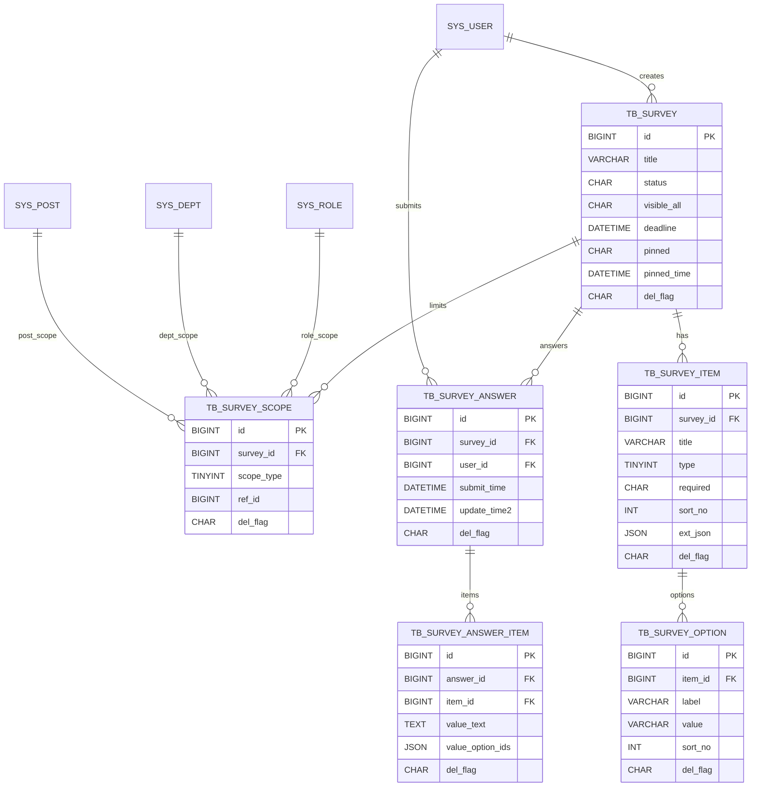

# 表单收集（问卷）模块 — 数据模型介绍（MVP）

> 依据本仓库最新 DDL 与草案归纳：
>
> - 标准 DDL：`docs/sql/表单收集-DDL.md`
> - 草案汇总：`book-mis.sql`
> - 日期：2025-11-07
>
> 约定：不建数据库物理外键，统一采用“逻辑外键 + 必要索引”；与 RuoYi 的 `sys_user/sys_role/sys_dept/sys_post` 做逻辑关联；统一审计与软删字段。

---

## 模块概览

- 业务目标：支持按“可见范围（全员或角色/部门/岗位并集）”发布问卷（表单），用户在截止前提交/修改，管理侧可置顶、归档、延期。
- 核心对象：问卷主体（tb_survey）、可见范围（tb_survey_scope）、题目（tb_survey_item）、选项（tb_survey_option）、答卷（tb_survey_answer）、答案明细（tb_survey_answer_item）。
- 题型：1文本、2单选、3多选；为“文件/时间”等扩展预留 ext_json，选项仅用于单选/多选题。
- 约束：一个用户每份问卷仅允许一份提交（tb_survey_answer 唯一键）；归档后不可再提交；延期只更新 deadline。

---

## 关系图（ER 概览）



> 注：所有“FK”均为逻辑外键，不建硬 FK；通过应用校验与必要索引保障一致性。

---

## 表与字段详解（逐表）

### 1) tb_survey（问卷-主表）
- 用途：承载问卷元数据（状态、可见范围、截止、置顶等）。
- 关键索引：
  - `idx_status_deadline(status, deadline)`：发布中/即将到期列表与筛选。
  - `idx_create_by(create_by)`：按创建人检索。
- 字段说明：
  - `id` BIGINT PK — 问卷主键。
  - `title` VARCHAR(200) NOT NULL — 问卷标题/表单名称。
  - `status` CHAR(1) DEFAULT '1' — 0草稿 1发布 2归档。
  - `visible_all` CHAR(1) DEFAULT '1' — 1全员可见 0按范围（取并集）。
  - `deadline` DATETIME — 截止时间（超过后不可提交/修改）。
  - `remark` VARCHAR(500) — 备注。
  - `pinned` CHAR(1) DEFAULT '0' / `pinned_time` DATETIME — 置顶控制与排序辅助。
  - 审计/软删：`create_by/create_time/update_by/update_time/del_flag`。
- 业务约定：
  - 置顶列表排序：`pinned DESC, pinned_time DESC, create_time DESC`。
  - 归档后不可提交新答卷，不可修改既有答卷；延期仅更新 `deadline`。

### 2) tb_survey_scope（问卷-可见范围）
- 用途：当 `visible_all=0` 时，限定可见人群；范围类型支持角色/部门/岗位的并集。
- 关键约束与索引：
  - UNIQUE `uk_scope(survey_id, scope_type, ref_id)`：防重复范围项。
  - `idx_survey(survey_id)`：按问卷加载范围。
- 字段说明：
  - `id` BIGINT PK — 主键。
  - `survey_id` BIGINT NOT NULL — 问卷ID（逻辑外键：tb_survey.id）。
  - `scope_type` TINYINT NOT NULL — 0角色 1部门 2岗位。
  - `ref_id` BIGINT NOT NULL — 引用ID：`sys_role.role_id / sys_dept.dept_id / sys_post.post_id`。
  - 审计/软删字段。
- 可见性判定（应用层）：
  - 若 `visible_all=1` 则可见；否则用户满足以下任一即可：角色包含/部门匹配/岗位包含。

### 3) tb_survey_item（问卷-题目）
- 用途：定义题目清单、排序与是否必填；通过 ext_json 承载扩展配置。
- 关键索引：
  - `idx_survey_sort(survey_id, sort_no)`：按序加载题目。
- 字段说明：
  - `id` BIGINT PK — 主键。
  - `survey_id` BIGINT NOT NULL — 问卷ID。
  - `title` VARCHAR(300) NOT NULL — 题目/提示文本。
  - `type` TINYINT NOT NULL — 1文本 2单选 3多选（预留 4文件/5时间）。
  - `required` CHAR(1) DEFAULT '0' — 是否必填：0否 1是。
  - `sort_no` INT DEFAULT 0 — 排序号（0开始）。
  - `ext_json` JSON — 扩展配置（示例：文本题`{"placeholder":"","maxLen":200}`；时间题`{"precision":"date|datetime"}`；文件题`{"accept":[".pdf",".png"],"maxSizeMB":5}`）。
  - 审计/软删字段。
- 校验建议：
  - 多选题可在 ext_json 约束最少/最多选项数；文本题限制最大长度与必填。

### 4) tb_survey_option（问卷-选项，仅用于单/多选）
- 用途：为单选/多选题提供候选选项。
- 关键索引：
  - `idx_item_sort(item_id, sort_no)`：按序加载选项。
- 字段说明：
  - `id` BIGINT PK — 主键。
  - `item_id` BIGINT NOT NULL — 题目ID（逻辑外键：tb_survey_item.id）。
  - `label` VARCHAR(200) NOT NULL — 选项展示文本。
  - `value` VARCHAR(200) — 选项值（可空；为空时默认等于 label）。
  - `sort_no` INT DEFAULT 0 — 排序号。
  - 审计/软删字段。

### 5) tb_survey_answer（问卷-答卷，每人一份）
- 用途：记录某用户对一份问卷的整体提交与最近修改时间。
- 关键约束与索引：
  - UNIQUE `uk_survey_user(survey_id, user_id)`：保证“一人一份”。
  - `idx_survey(survey_id)`：统计/导出。
- 字段说明：
  - `id` BIGINT PK — 主键。
  - `survey_id` BIGINT NOT NULL — 问卷ID。
  - `user_id` BIGINT NOT NULL — 提交人用户ID（逻辑外键：sys_user.user_id）。
  - `submit_time` DATETIME — 首次提交时间（或最近提交时间）。
  - `update_time2` DATETIME — 最近修改时间（命名避开审计字段）。
  - 审计/软删字段。
- 行为约定：
  - 截止前允许修改（更新 `update_time2`，并覆盖答案明细）；截止或归档后禁止修改/新建。

### 6) tb_survey_answer_item（问卷-答案明细）
- 用途：承载逐题的作答内容（文本值或选项ID数组）。
- 关键约束与索引：
  - UNIQUE `uk_answer_item(answer_id, item_id)`：同一答卷同一题仅一条。
  - `idx_answer(answer_id)`：按答卷加载明细。
- 字段说明：
  - `id` BIGINT PK — 主键。
  - `answer_id` BIGINT NOT NULL — 答卷ID（逻辑外键：tb_survey_answer.id）。
  - `item_id` BIGINT NOT NULL — 题目ID（逻辑外键：tb_survey_item.id）。
  - `value_text` TEXT — 文本题的答案。
  - `value_option_ids` JSON — 单/多选题的答案（JSON 数组，元素为 tb_survey_option.id）。
  - 审计/软删字段。
- 校验约定（应用层）：
  - `required=1` 的题目必须提供对应答案；
  - 单选题：`value_option_ids` 必须是长度=1 的数组；
  - 多选题：`value_option_ids` 为长度≥1 的数组，并满足 ext_json 中 min/max 约束；
  - 所有选项ID必须属于同一 `item_id`，且该 item 属于该 `survey_id`。

---

## 枚举与状态
- 问卷 `status`：0=草稿、1=发布、2=归档。
- 可见 `visible_all`：1=全员、0=按范围（角色/部门/岗位并集）。
- 置顶 `pinned`：0=否、1=是。
- 题型 `type`：1=文本、2=单选、3=多选（预留4=文件、5=时间）。
- 必填 `required`：'0'=否、'1'=是。
- 软删 `del_flag`：'0'=存在、'2'=删除。

---

## 典型查询与用法示例

- 用户可见的“发布中且未归档”问卷（含置顶排序，按是否过期可再细分）：
```sql
-- 输入：:userId, :roleIds, :postIds, :deptId
SELECT s.*
FROM tb_survey s
WHERE s.del_flag='0' AND s.status='1'
  AND (
    s.visible_all='1'
    OR EXISTS (
      SELECT 1 FROM tb_survey_scope sc
      WHERE sc.del_flag='0' AND sc.survey_id=s.id AND (
        (sc.scope_type=0 AND sc.ref_id IN (:roleIds)) OR
        (sc.scope_type=1 AND sc.ref_id = :deptId) OR
        (sc.scope_type=2 AND sc.ref_id IN (:postIds))
      )
    )
  )
ORDER BY s.pinned DESC, s.pinned_time DESC, s.create_time DESC
LIMIT :offset, :size;
```

- 加载问卷结构（题目+选项）：
```sql
SELECT * FROM tb_survey_item WHERE survey_id=:sid AND del_flag='0' ORDER BY sort_no;
SELECT * FROM tb_survey_option WHERE item_id IN (:itemIds) AND del_flag='0' ORDER BY sort_no;
```

- 保存/更新答卷（保证“一人一份”）：
```sql
INSERT INTO tb_survey_answer(survey_id, user_id, submit_time, update_time2, create_by, update_by)
VALUES(:sid, :uid, NOW(), NOW(), :uname, :uname)
ON DUPLICATE KEY UPDATE submit_time=NOW(), update_time2=NOW(), update_by=VALUES(update_by), update_time=NOW();
```

- 写入答案明细（先删后插或按唯一键覆盖）：
```sql
-- 先删除旧答案（防并发可在事务中执行）
DELETE FROM tb_survey_answer_item WHERE answer_id=:aid AND del_flag='0';
-- 再按题型批量写入（文本题写 value_text；单/多选写 value_option_ids 为 JSON 数组）
```

- 校验选项是否属于该题：
```sql
SELECT 1
FROM tb_survey_option o
WHERE o.item_id = :itemId AND o.id IN (:optIds) AND o.del_flag='0'
HAVING COUNT(1) = :optCount;
```

- 统计提交人数与完成率：
```sql
SELECT COUNT(1) FROM tb_survey_answer WHERE survey_id=:sid AND del_flag='0';
```

- 归档/延期：
```sql
UPDATE tb_survey SET status='2', update_by=:uname, update_time=NOW() WHERE id=:sid AND del_flag='0';
UPDATE tb_survey SET deadline=:newDeadline, update_by=:uname, update_time=NOW() WHERE id=:sid AND del_flag='0';
```

---

## 设计要点与实现建议
- 可见范围：
  - `visible_all=1` 直达；否则以 `tb_survey_scope` 对用户的角色/部门/岗位做“并集”匹配。
- 题型与扩展：
  - 文本/单选/多选覆盖 MVP；扩展题型通过 `ext_json` 升级，无需改动答案表结构。
- 数据一致性：
  - 用逻辑外键 + 唯一/复合索引；提交/更新答卷与答案需在事务内完成。
- 并发与幂等：
  - `uk_survey_user` 保证“一人一份”；保存答案采用“先删后插”或按唯一键覆盖策略。
- 安全：
  - 严格校验题型与选项归属；对用户输入做长度与内容限制；前后端均做必填校验。
- 性能：
  - 题目与选项按 `sort_no` 一次加载；列表按置顶与创建时间排序；索引覆盖常用筛选。

---

## 建表顺序与示例数据
- 建表顺序：`tb_survey` → `tb_survey_scope` → `tb_survey_item` → `tb_survey_option` → `tb_survey_answer` → `tb_survey_answer_item`。
- 示例数据：参见 `docs/sql/表单收集-DDL.md`（“迎新信息登记”示例：文本/单选/多选）。

---

## 版本记录
- 2025-11-07：首版（主体/范围/题目/选项/答卷/答案明细）；新增置顶字段 `pinned/pinned_time`。

> 注：本文件为模型解释文档，标准 DDL 以 `docs/sql/表单收集-DDL.md` 为准；如有差异，以 DDL 为最终依据。

