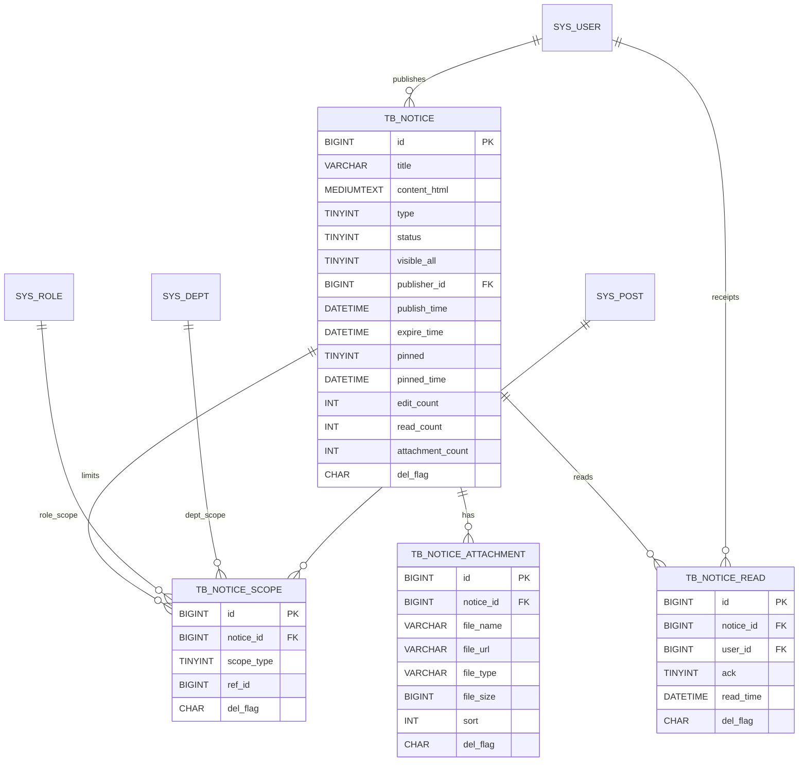

# 通知公告模块 — 数据模型介绍（MVP）

> 依据本仓库最新 DDL 与草案归纳：
>
> - 标准 DDL：`docs/sql/通知公告-DDL.md`
> - 草案汇总：`book-mis.sql`（含字典与菜单接入）
> - 日期：2025-10-19
>
> 约定：不做数据库物理外键，均为“逻辑外键”与必要索引；与 RuoYi 的 `sys_user/sys_role/sys_dept/sys_post` 逻辑关联。

---

## 模块概览

- 业务目标：面向全体或特定人群发布“通知/公告”，支持置顶、到期控制、可见范围限制、附件与阅读回执。
- 核心对象：公告主体（tb_notice）、可见范围（tb_notice_scope）、附件（tb_notice_attachment）、阅读回执（tb_notice_read）。
- 可见范围：`visible_all=1` 全员可见；否则通过 `tb_notice_scope` 指定角色/部门/岗位的并集可见。
- 集成约定：与 RuoYi 字典类型对齐（`sys_notice_type/sys_notice_status`）；菜单/权限对齐 `system:notice:*`。
- 审计与软删：所有表统一 `create_by/create_time/update_by/update_time/del_flag`，`del_flag='2'` 表示软删。

---

## 关系图（ER 概览）



> 注：`publisher_id/user_id` 与 `sys_user.user_id` 逻辑关联；`scope_type/ref_id` 与 `sys_role/sys_dept/sys_post` 逻辑关联。

---

## 表与字段详解（逐表）

### 1) tb_notice（通知公告-主体）
- 用途：承载公告内容与元数据（发布状态、置顶、到期控制、统计冗余）。
- 关键约束与索引：
  - PK：`id`
  - IDX：
    - `idx_notice_status_pub(status, pinned, pinned_time, publish_time)` — 列表与置顶排序常用复合索引；
    - `idx_notice_expire(expire_time)` — 到期扫描；
    - `idx_notice_publisher(publisher_id)` — 我的发布列表；
    - `idx_notice_title(title)` — 标题搜索（前缀/LIKE）。
- 字段说明：
  - `id` BIGINT PK — 公告主键。
  - `title` VARCHAR(200) NOT NULL — 标题。
  - `content_html` MEDIUMTEXT NOT NULL — 富文本 HTML 内容（存储已净化的 HTML）。
  - `type` TINYINT NOT NULL DEFAULT 2 — 类型：1-通知 2-公告（参照字典 `sys_notice_type`）。
  - `status` TINYINT NOT NULL DEFAULT 0 — 0-草稿 1-已发布 2-撤回 3-已过期（参照字典 `sys_notice_status`）。
  - `visible_all` TINYINT NOT NULL DEFAULT 1 — 是否全员可见：1-是 0-否；为 0 时生效 `tb_notice_scope` 限定并集。
  - `publisher_id` BIGINT NOT NULL — 发布者用户ID（逻辑外键：`sys_user.user_id`）。
  - `publish_time` DATETIME — 发布时间（`status=1` 时应有值）。
  - `expire_time` DATETIME — 到期时间（超过即视为已过期，应用层定时/查询计算）。
  - `pinned` TINYINT NOT NULL DEFAULT 0 — 是否置顶：0-否 1-是。
  - `pinned_time` DATETIME — 置顶时间（置顶排序辅助）。
  - `edit_count` INT NOT NULL DEFAULT 0 — 编辑次数（每次保存+1，用于审计/对比）。
  - `read_count` INT NOT NULL DEFAULT 0 — 阅读次数（冗余计数，接口侧聚合回写）。
  - `attachment_count` INT NOT NULL DEFAULT 0 — 附件数量（冗余计数，上传/删除附件后更新）。
  - `remark` VARCHAR(500) — 备注。
  - `create_by/create_time/update_by/update_time/del_flag` — 审计与软删。
- 业务约定：
  - 置顶排序优先按 `pinned DESC, pinned_time DESC, publish_time DESC`。
  - 过期判断：`expire_time IS NOT NULL AND NOW() > expire_time` 视为已过期（可自动回写 `status=3` 或查询侧过滤）。

### 2) tb_notice_scope（通知公告-可见范围）
- 用途：为非全员公告指定可见人群，支持“角色/部门/岗位”的并集（多条记录）。
- 关键约束与索引：
  - PK：`id`
  - UK：`uk_scope_unique(notice_id, scope_type, ref_id, del_flag)` — 避免重复范围项（软删可重建）。
  - IDX：`idx_scope_notice(notice_id)`、`idx_scope_type_ref(scope_type, ref_id)`。
- 字段说明：
  - `id` BIGINT PK — 主键。
  - `notice_id` BIGINT NOT NULL — 公告ID（逻辑外键：tb_notice.id）。
  - `scope_type` TINYINT NOT NULL — 0-角色 1-部门 2-岗位。
  - `ref_id` BIGINT NOT NULL — 引用ID：`sys_role.role_id / sys_dept.dept_id / sys_post.post_id`。
  - `remark` VARCHAR(255) — 备注。
  - `create_by/create_time/update_by/update_time/del_flag` — 审计与软删。
- 可见性判定（应用层伪逻辑）：
  - 若 `visible_all=1` 则直接可见；
  - 否则用户满足以下任一条件即可可见：
    - `EXISTS scope(scope_type=0 AND ref_id IN userRoles)`
    - OR `EXISTS scope(scope_type=1 AND ref_id = user.dept_id)`
    - OR `EXISTS scope(scope_type=2 AND ref_id IN userPosts)`

### 3) tb_notice_attachment（通知公告-附件）
- 用途：公告附件（OSS URL），支持排序；删除附件需同步回写主体的 `attachment_count`。
- 关键约束与索引：
  - PK：`id`
  - IDX：`idx_attach_notice(notice_id)`
- 字段说明：
  - `id` BIGINT PK — 主键。
  - `notice_id` BIGINT NOT NULL — 公告ID（逻辑外键：tb_notice.id）。
  - `file_name` VARCHAR(255) NOT NULL — 文件名（展示）。
  - `file_url` VARCHAR(1024) NOT NULL — 文件 URL（OSS 直链/授权链接）。
  - `file_type` VARCHAR(50) — 文件类型（扩展名或 MIME）。
  - `file_size` BIGINT — 文件大小（字节）。
  - `sort` INT NOT NULL DEFAULT 0 — 序号（升序显示）。
  - `remark` VARCHAR(255) — 备注。
  - `create_by/create_time/update_by/update_time/del_flag` — 审计与软删。

### 4) tb_notice_read（通知公告-阅读回执）
- 用途：记录用户阅读时间与确认状态（MVP `ack` 预留），限制一用户对同一公告仅一条有效记录。
- 关键约束与索引：
  - PK：`id`
  - UK：`uk_notice_read(notice_id, user_id, del_flag)` — 单用户单公告唯一有效回执。
  - IDX：`idx_read_user(user_id)` — 我的已读列表。
- 字段说明：
  - `id` BIGINT PK — 主键。
  - `notice_id` BIGINT NOT NULL — 公告ID（逻辑外键：tb_notice.id）。
  - `user_id` BIGINT NOT NULL — 用户ID（逻辑外键：sys_user.user_id）。
  - `ack` TINYINT NOT NULL DEFAULT 0 — 是否确认（预留；后续可支持“需确认”的通知）。
  - `read_time` DATETIME DEFAULT CURRENT_TIMESTAMP — 阅读时间。
  - `remark` VARCHAR(255) — 备注。
  - `create_by/create_time/update_by/update_time/del_flag` — 审计与软删。

---

## 枚举与状态
- 公告 `type`：1=通知、2=公告（`sys_notice_type`）。
- 公告 `status`：0=草稿、1=已发布、2=撤回、3=已过期（`sys_notice_status`）。
- 范围 `scope_type`：0=角色、1=部门、2=岗位。
- 置顶 `pinned`：0=否、1=是。
- 可见 `visible_all`：1=全员、0=按范围。
- 软删 `del_flag`：'0'=存在、'2'=删除。

---

## 典型查询与用法示例

- 前台列表（包含置顶、未过期、对当前用户可见）：
```sql
-- 变量：:userId, :roleIds, :postIds, :deptId
SELECT n.*
FROM tb_notice n
WHERE n.del_flag='0'
  AND n.status = 1
  AND (n.expire_time IS NULL OR n.expire_time > NOW())
  AND (
    n.visible_all = 1
    OR EXISTS (
      SELECT 1 FROM tb_notice_scope s
      WHERE s.del_flag='0' AND s.notice_id = n.id AND (
        (s.scope_type=0 AND s.ref_id IN (:roleIds)) OR
        (s.scope_type=1 AND s.ref_id = :deptId) OR
        (s.scope_type=2 AND s.ref_id IN (:postIds))
      )
    )
  )
ORDER BY n.pinned DESC, n.pinned_time DESC, n.publish_time DESC
LIMIT :offset, :size;
```

- 阅读回执写入（存在即更新）：
```sql
-- 方式一：先查后插/更新（或使用 ON DUPLICATE KEY 需调整唯一键不含 del_flag）
INSERT INTO tb_notice_read(notice_id, user_id, ack, read_time, create_by, update_by)
VALUES (:nid, :uid, 0, NOW(), :uname, :uname)
ON DUPLICATE KEY UPDATE read_time = VALUES(read_time), update_by = VALUES(update_by), update_time = NOW();
```

- 附件数量回写：
```sql
UPDATE tb_notice n
SET n.attachment_count = (
  SELECT COUNT(1) FROM tb_notice_attachment a
  WHERE a.notice_id = n.id AND a.del_flag='0'
), n.update_by=:uname, n.update_time=NOW()
WHERE n.id = :nid AND n.del_flag='0';
```

- 到期批处理（可选，将过期公告状态回写为3）：
```sql
UPDATE tb_notice
SET status = 3, update_by='system', update_time=NOW()
WHERE status=1 AND expire_time IS NOT NULL AND expire_time <= NOW() AND del_flag='0';
```

---

## 设计要点与实现建议
- 可见性与范围：
  - `visible_all=1` 走全员；否则通过 `tb_notice_scope` 的并集（角色/部门/岗位）判断。
  - 用户维度数据来自 RuoYi：`sys_user_role/sys_user_post/sys_user.dept_id`。
- 置顶与排序：
  - 列表排序建议：`pinned DESC, pinned_time DESC, publish_time DESC, id DESC`。
  - 建议置顶数量控制或分页首屏内渲染，避免“全置顶”影响体验。
- 阅读计数：
  - 建议接口侧以 Redis 增量计数，定时落库到 `read_count`。
  - 阅读回执使用 `tb_notice_read` 记录“用户已读”；是否强制“未读提醒”由业务决定。
- 附件管理：
  - 文件上传到 OSS，保存 `file_url`；删除附件需同步回写 `attachment_count`。
- 一致性与外键策略：
  - 采用“逻辑外键 + 索引”，避免升级与跨库迁移的复杂度。
  - `uk_scope_unique` 包含 `del_flag`，允许“软删后重建同项”。
- 安全：
  - `content_html` 写入前进行 XSS 过滤与白名单保留。
  - 附件下载 URL 视场景使用带有效期的授权地址。

---

## 建表顺序与示例数据
- 建表顺序：`tb_notice` → `tb_notice_scope` → `tb_notice_attachment` → `tb_notice_read`。
- 示例数据：见 `docs/sql/通知公告-DDL.md` 中 “示例数据（最小集）”。

---

## 版本记录
- 2025-10-19：首版（主体/范围/附件/回执）与索引策略；软删与审计字段统一。

> 注：本文件为模型解释文档，标准 DDL 以 `docs/sql/通知公告-DDL.md` 为准；如有差异，以 DDL 为最终依据。

